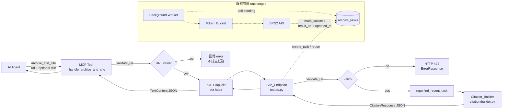
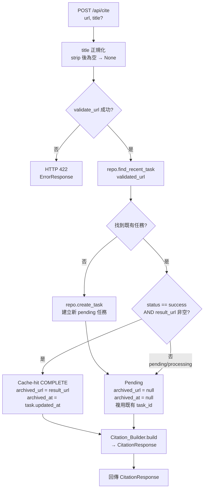
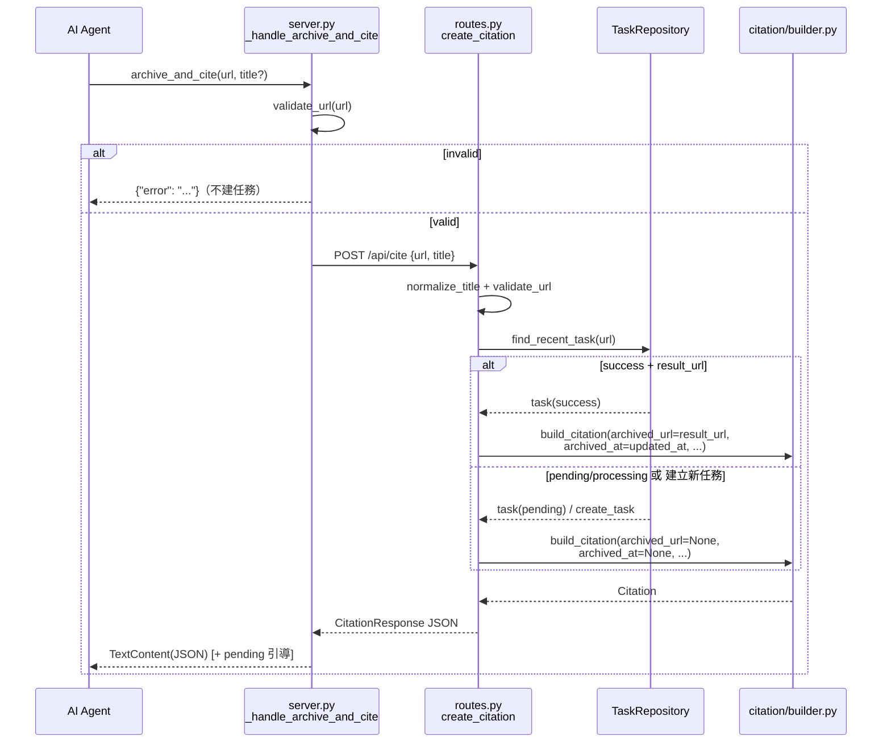
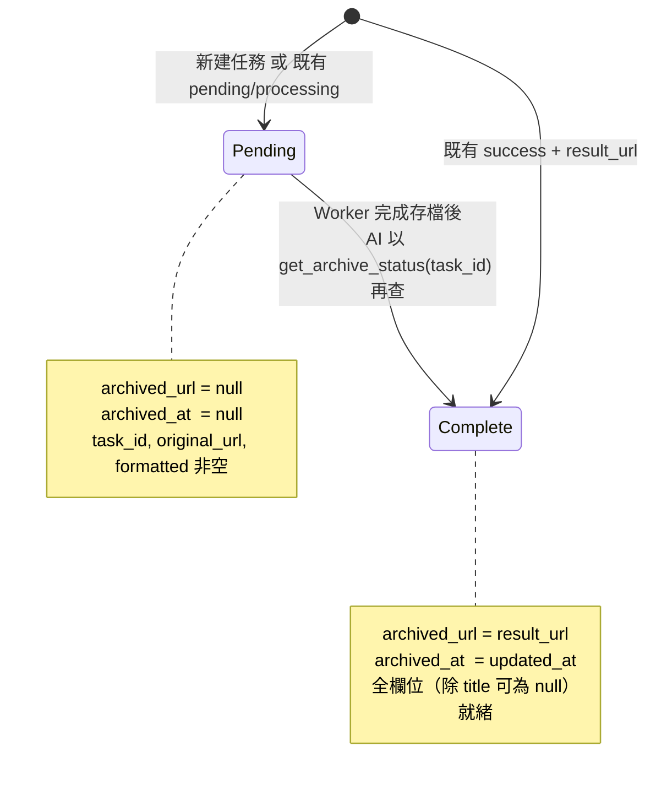

# Design Document: archive_and_cite

## Overview

`archive_and_cite` 為 KeepLink-MCP 新增一個 MCP 工具，讓 AI agent 在一次呼叫中同時完成兩件事：把引用來源 URL 排入既有存檔佇列，並立即取回一個結構化的 Citation（包含可直接貼上的 `formatted` 字串），指向 permanent Wayback Machine URL。此舉解決 AI 研究過程中的 link rot 問題。

本設計嚴格遵循三個核心約束：

1. **Local-first / LLM-free / Deterministic**：不呼叫任何 LLM、不抓取頁面內容。Citation 的 `title` 一律由呼叫端提供，格式化邏輯純粹由輸入參數與存檔狀態確定性推導。
2. **完全複用既有存檔管線**：URL validation/normalization（`validate_url`）、24h dedup（`find_recent_task`）、任務建立（`create_task`）、Worker、Token_Bucket rate limiter、exponential backoff retry 全部沿用，不修改、不重新發明。
3. **Separation of Concerns**：Citation 的產生與格式化邏輯抽離為獨立的 `citation` package（`Citation_Builder`），與 archiving / routing / persistence 分離。

新增面（surface area）刻意最小化：一個新的 MCP 工具（`server.py`）、一個新的 HTTP 端點（`/api/cite`）、一個新的 Pydantic schema（`CitationResponse` + `CiteRequest`）、一個新的純函式模組（`citation/builder.py`）。**無資料庫 schema 變更**。

---

## Architecture

### 整體資料流

`archive_and_cite` 工具維持與 `archive_url` 完全一致的 non-blocking 行為（<50ms 回傳），差異僅在於它額外呼叫 `Citation_Builder` 把存檔狀態轉換為 Citation。



存檔本身仍由既有 Worker 非同步完成；`archive_and_cite` 不等待存檔結束。若當下已有成功任務（Cache_Hit），Citation 立即完整；否則回傳 Pending_Citation，由 AI 稍後以 `get_archive_status(task_id)` 補完。

### Cite_Endpoint 決策樹

Cite_Endpoint 依 `find_recent_task` 的結果與任務狀態，決定 Citation 形態。關鍵：`find_recent_task` 會回傳 24h 窗內 pending / processing / **success** 的任務。



> **設計決策：為何不用 `get_latest_task_by_url`？**
> `find_recent_task` 已是既有 dedup 邏輯的單一真實來源（24h 窗、排除 failed）。沿用它可確保 Cite_Endpoint 的去重行為與 `POST /api/archive` 完全一致（Requirement 2.3），避免出現兩套語意分歧的查詢。若既有任務為 `failed`，`find_recent_task` 回傳 None，Cite_Endpoint 會建立新任務並重新進入管線 —— 與 `archive_url` 行為對齊。

> **設計決策：`archived_at` 的來源。**
> 資料庫沒有獨立的 `archived_at` 欄位。`mark_success` 在任務轉為 success 時會設定 `updated_at`，因此對 success 任務而言 `updated_at` 即「達到 success 狀態的時間」。Citation 的 `archived_at` 直接採用 success 任務的 `task.updated_at`。此為**無 schema 變更**的關鍵前提（詳見 Data Models）。

---

## Components and Interfaces

### Component 1: Citation_Builder（新模組，純函式）

**New File:** `src/keeplink_mcp/citation/builder.py`（新增 `citation` package，含 `__init__.py`）

單一職責：把「title、original_url、存檔狀態」確定性地轉換為 Citation 欄位與 `formatted` 字串。**無任何 I/O**（no network / no page fetch / no LLM / no DB）。模組維持 <200 行。

介面（interface first，先定義簽章）：

```python
"""Deterministic citation builder — pure formatting, no I/O.

Single Responsibility: given archive state and caller-supplied metadata,
produce a Citation payload (structured fields + a paste-ready `formatted`
string). Performs NO network request, page fetch, LLM call, or DB access.
"""

from __future__ import annotations

from dataclasses import dataclass
from datetime import datetime


@dataclass(frozen=True)
class Citation:
    """Immutable structured citation.

    Invariants (see Correctness Properties):
    - original_url, task_id, formatted are always non-null.
    - Pending  : archived_url is None  AND archived_at is None.
    - Complete : archived_url is not None AND archived_at is not None.
    """

    title: str | None
    original_url: str
    archived_url: str | None
    archived_at: datetime | None
    task_id: str
    formatted: str


def normalize_title(title: str | None) -> str | None:
    """Return a trimmed title, or None if it is missing or whitespace-only.

    Encodes Requirement 5.3 (whitespace-only title → null). Kept as a small
    reusable helper so both the endpoint and the builder share one rule.
    """
    ...


def build_citation(
    *,
    title: str | None,
    original_url: str,
    task_id: str,
    archived_url: str | None,
    archived_at: datetime | None,
) -> Citation:
    """Build a Citation deterministically from the given archive state.

    Contract:
    - If archived_url is None (pending) → archived_at MUST be None; produces a
      Pending_Citation whose `formatted` states archiving is in progress and
      includes original_url and task_id.
    - If archived_url is not None (complete) → archived_at MUST be provided;
      produces a complete `formatted` reference.
    - title is normalized via normalize_title() before use.

    Raises:
        ValueError: if the (archived_url, archived_at) pair is inconsistent
                    (fail-fast — one set but not the other).
    """
    ...


def _format_complete(
    *, title: str | None, original_url: str, archived_url: str, archived_at: datetime
) -> str:
    """Format a completed citation.

    - With title    : `[title](archived_url) (original: original_url, archived YYYY-MM-DD)`
    - Without title  : archived_url is used as the link text in place of a title.
    Date is rendered as YYYY-MM-DD (Requirement 3.5).
    """
    ...


def _format_pending(*, original_url: str, task_id: str) -> str:
    """Format a pending citation stating archiving is in progress,
    including both original_url and task_id (Requirement 4.3).
    """
    ...
```

設計要點：

- 所有函式為 pure functions；`build_citation` 以 keyword-only 參數確保呼叫端明確傳遞狀態。
- **Fail-fast 一致性檢查**：`build_citation` 若收到 `archived_url` 與 `archived_at` 只設其一的矛盾組合，直接 `raise ValueError`，不以 fallback 掩蓋（符合 codebase 的 fail-fast 慣例）。這也讓「completeness invariant」在建構期即被強制。
- 日期格式化使用 `archived_at.strftime("%Y-%m-%d")`（Requirement 3.5）。

### Component 2: Cite_Endpoint（修改 routes.py）

**Modified File:** `src/keeplink_mcp/api/routes.py`

新增 `POST /api/cite`，鏡射 `create_archive` 的 validation / dedup 結構，但輸出 `CitationResponse`。

```python
@router.post(
    "/cite",
    response_model=CitationResponse,
    responses={422: {"model": ErrorResponse}},
)
async def create_citation(
    request: CiteRequest,
    session: SessionDep,
) -> CitationResponse | ErrorResponse:
    """Archive a cited source and return a structured citation.

    Flow (mirrors create_archive for validation + dedup):
      1. normalize title (whitespace-only → None)
      2. validate_url → 422 on failure (fail-fast)
      3. find_recent_task for dedup
      4. classify state (cache-hit complete vs pending) and reuse/create task
      5. build Citation via Citation_Builder and return it
    """
    ...
```

行為規格（EARS 對映）：

| 步驟 | 行為 | Requirement |
|------|------|-------------|
| title 正規化 | `normalize_title(request.title)`，whitespace-only → None | 5.1, 5.2, 5.3 |
| URL 驗證 | `validate_url`；失敗回 `JSONResponse(422, {"detail": ...})`，不建任務 | 2.1, 6.2 |
| 去重查詢 | `repo.find_recent_task(validated_url)` | 2.3 |
| 無既有任務 | `repo.create_task(validated_url)` → 進入既有 Worker/rate-limit/retry 管線 | 2.2 |
| 既有 success + result_url | Cache-hit COMPLETE：`archived_url=result_url`, `archived_at=task.updated_at` | 3.1, 3.2 |
| 既有 pending/processing | Pending：複用 task_id，`archived_url=None`, `archived_at=None` | 4.1, 4.2 |
| 無頁面抓取 / 無 LLM | 端點僅讀 DB 與呼叫純函式 | 2.4, 2.5, 8.3 |

Cite_Endpoint 不新增 repository 方法 —— 完全使用既有的 `find_recent_task` 與 `create_task`。

### Component 3: CiteRequest / CitationResponse schemas（修改 schemas.py）

**Modified File:** `src/keeplink_mcp/api/schemas.py`

```python
class CiteRequest(BaseModel):
    """Request body for POST /api/cite."""

    url: str
    title: str | None = None  # whitespace-only is normalized to None at the endpoint


class CitationResponse(BaseModel):
    """Response for POST /api/cite — a structured, paste-ready citation.

    original_url, task_id, and formatted are always non-null. When archiving
    is still pending, archived_url and archived_at are both null.
    """

    title: str | None = None
    original_url: str
    archived_url: str | None = None
    archived_at: datetime | None = None
    task_id: str
    formatted: str
```

`CitationResponse` 的欄位對齊 Requirement 7.1；non-null 保證（`original_url` / `task_id` / `formatted`）與 pending 時 `archived_url` / `archived_at` 皆 null 的規則（7.2、7.3）由 Cite_Endpoint 與 Citation_Builder 的建構契約共同保證。

### Component 4: archive_and_cite MCP 工具（修改 server.py）

**Modified File:** `src/keeplink_mcp/mcp_server/server.py`

在 `list_tools()` 新增 `Tool`，於 `call_tool()` 分派至 `_handle_archive_and_cite`，並沿用既有 `httpx.AsyncClient(base_url, timeout=10.0)` 與 ConnectError/ConnectTimeout 處理模式。

Tool 註冊（inputSchema）：

```python
Tool(
    name="archive_and_cite",
    description=(
        "Archive a cited web source AND get back a paste-ready citation in one call. "
        "Non-blocking (<50ms): archiving runs in the background. "
        "If the URL was already archived within 24h, you get a COMPLETE citation "
        "immediately (formatted markdown link to the permanent Wayback Machine URL). "
        "Otherwise you get a PENDING citation with a task_id — call get_archive_status "
        "with that task_id later to obtain the permanent archived_url and complete the "
        "citation. KeepLink does NOT fetch page content or call any LLM; supply the "
        "page title yourself if you want it in the citation. "
        "Response fields: title, original_url, archived_url, archived_at, task_id, formatted."
    ),
    inputSchema={
        "type": "object",
        "properties": {
            "url": {
                "type": "string",
                "description": "The source URL to archive and cite (http or https).",
            },
            "title": {
                "type": "string",
                "description": (
                    "Optional page title you already read; used as the citation "
                    "link text. Whitespace-only titles are treated as absent."
                ),
            },
        },
        "required": ["url"],
    },
)
```

Handler 介面與行為：

```python
async def _handle_archive_and_cite(arguments: dict, base_url: str) -> list[TextContent]:
    """Handle archive_and_cite: validate URL → POST /api/cite → return citation.

    - Invalid URL      → error result, no task created (Req 6.1, 6.3).
    - Backend down     → {"error": "Backend service unavailable"} (Req 1.5).
    - Pending citation → return CitationResponse JSON plus guidance text telling
      the caller to invoke get_archive_status(task_id) to complete it (Req 4.4).
    - Complete citation→ return CitationResponse JSON as TextContent.
    """
    ...
```

- URL 驗證在轉發前先行（與 `_handle_archive_url` 相同），失敗即回 error、絕不 POST，因此不會建立任務（Requirement 6.1、6.3）。
- backend 不可達的處理與既有 handler 逐字一致（Requirement 1.5）。
- Pending 時（回應中 `archived_url` 為 null）在 TextContent 內附上引導字串，指示呼叫端以 `task_id` 呼叫 `get_archive_status` 補完（Requirement 4.4）。

### 模組互動總覽



---

## Data Models

### 無資料庫 schema 變更

現有 `archive_tasks` 表已足以支撐所有需求，**不需要 migration**。Citation 的每個欄位皆可由既有欄位推導：

| Citation 欄位 | 來源 | 說明 |
|---------------|------|------|
| `title` | 呼叫端輸入（正規化後） | KeepLink 不抓頁面，title 一律由 AI 提供 |
| `original_url` | `validate_url(request.url)` | 正規化後的來源 URL |
| `archived_url` | `task.result_url`（success 時）/ 否則 `None` | permanent Wayback Machine URL |
| `archived_at` | `task.updated_at`（success 時）/ 否則 `None` | success 任務的 `updated_at` 即達成 success 的時間戳 |
| `task_id` | `task.task_id`（建立或複用） | 追蹤 ID，pending 時供 `get_archive_status` 使用 |
| `formatted` | `Citation_Builder` 由上述欄位確定性推導 | 可直接貼上的 markdown/純文字字串 |

> **關鍵前提再述**：因 `mark_success` 會在轉為 success 時寫入 `result_url` 與 `updated_at`，故 `archived_at` 直接取 success 任務的 `updated_at`，無需新增欄位。對 pending/processing/failed 任務，`archived_at` 與 `archived_url` 皆為 `None`。

### Citation 狀態機（兩種形態）



### 新增 / 修改檔案摘要

| 檔案 | 類型 | 用途 |
|------|------|------|
| `src/keeplink_mcp/citation/__init__.py` | 新增 | 建立 `citation` package |
| `src/keeplink_mcp/citation/builder.py` | 新增 | `Citation` dataclass + `build_citation` 純函式（<200 行） |
| `src/keeplink_mcp/api/schemas.py` | 修改 | 新增 `CiteRequest`、`CitationResponse` |
| `src/keeplink_mcp/api/routes.py` | 修改 | 新增 `POST /api/cite`（`create_citation`） |
| `src/keeplink_mcp/mcp_server/server.py` | 修改 | 新增 `archive_and_cite` Tool 與 `_handle_archive_and_cite` |
| `docs/handoverbook.md` | 修改 | 記錄工具與 async citation-completion 流程（Req 9.1、9.2） |
| `README.md` | 修改 | 記錄工具、Cache_Hit vs Pending、無抓頁/無 LLM 聲明（Req 9.3、9.4） |

無 repository 新方法、無 model 變更、無 config 變更。

---

## Correctness Properties

*A property is a characteristic or behavior that should hold true across all valid executions of a system — essentially, a formal statement about what the system should do. Properties serve as the bridge between human-readable specifications and machine-verifiable correctness guarantees.*

本功能的核心 `Citation_Builder` 為純確定性函式，非常適合 property-based testing（hypothesis）。以下屬性經去重整併（consolidation）後，每條各自提供獨立驗證價值。

### Property 1: 格式化確定性（Determinism）

*For any* combination of `title`（含 None 與 whitespace）、`original_url`、`task_id` 與 archive state（`archived_url` + `archived_at`，或 pending），呼叫 `build_citation` 任意多次皆產生完全相同的 `Citation`（所有欄位含 `formatted` 逐一相等）。

**Validates: Requirements 8.1, 8.2**

### Property 2: 兩態完整性不變式（Two-state Completeness Invariant）

*For any* built `Citation`（無論 pending 或 complete），`original_url`、`task_id`、`formatted` 皆為非 null；且當 pending 時 `archived_url` 與 `archived_at` **皆** 為 null，當 complete 時 `archived_url` 與 `archived_at` **皆** 為非 null。此不變式亦保證輸出恆含全部六個欄位。

**Validates: Requirements 1.3, 4.1, 4.2, 7.1, 7.2, 7.3**

### Property 3: Cache-hit 欄位對映（Cache-hit Mapping）

*For any* cache-hit success task with arbitrary `result_url` and `updated_at`, the resulting `Citation` SHALL have `archived_url == task.result_url` and `archived_at == task.updated_at`.

**Validates: Requirements 3.1, 3.2**

### Property 4: 完整引用（含 title）格式（Complete-with-title Format）

*For any* complete citation with a non-null `title`, `formatted` SHALL equal `[title](archived_url) (original: original_url, archived YYYY-MM-DD)`, where the date is `archived_at` rendered as `YYYY-MM-DD`.

**Validates: Requirements 3.3, 3.5**

### Property 5: 完整引用（無 title）格式（Complete-without-title Format）

*For any* complete citation with a null `title`, `formatted` SHALL use `archived_url` as the link text in place of a title, and still include the original URL and the `YYYY-MM-DD` archived date.

**Validates: Requirements 3.4, 3.5**

### Property 6: 進行中引用格式（Pending Format）

*For any* pending citation (null `archived_url`), `formatted` SHALL state that archiving is in progress and SHALL include both the `original_url` and the `task_id`.

**Validates: Requirements 4.3**

### Property 7: 標題正規化（Title Normalization）

*For any* input string `s`, `normalize_title(s)` SHALL return None when `s` is None or its stripped form is empty, and SHALL return the stripped value otherwise; the resulting `Citation.title` SHALL equal this normalized value.

**Validates: Requirements 5.1, 5.2, 5.3**

### Property 8: 無效 URL 拒絕且無副作用（Invalid URL Rejected, No Side Effect）

*For any* url string that fails `validate_url`, the Cite_Endpoint SHALL return HTTP 422 with an error detail and SHALL NOT create any ArchiveTask (task count unchanged).

**Validates: Requirements 2.1, 6.1, 6.2, 6.3**

### Property 9: 去重複用（Dedup Reuse）

*For any* validated url that already has a dedup-eligible task within the Dedup_Window, the Cite_Endpoint SHALL reuse that task (no new task created) and the returned `task_id` SHALL equal the existing task's `task_id`.

**Validates: Requirements 2.3**

### Property 10: 進行中引導文字（Pending Guidance at Tool Layer）

*For any* pending `CitationResponse` returned by the backend, the `archive_and_cite` tool result SHALL include guidance instructing the caller to invoke `get_archive_status` with the returned `task_id`.

**Validates: Requirements 4.4**

### Property 11: 無 I/O 純粹性（No-I/O Purity）

*For any* inputs to `build_citation` / `normalize_title`, the builder SHALL perform no network request, page fetch, LLM invocation, or DB access while producing a `Citation`.

**Validates: Requirements 2.4, 2.5, 8.3**

---

## Error Handling

| 情境 | 層 | 行為 | Requirement |
|------|----|------|-------------|
| URL 驗證失敗（Tool） | MCP Tool | 回傳 `{"error": "Invalid URL format: ..."}`，不 POST、不建任務 | 6.1, 6.3 |
| URL 驗證失敗（Endpoint） | Cite_Endpoint | `JSONResponse(status_code=422, {"detail": "Invalid URL: ..."})`，不建任務 | 2.1, 6.2 |
| Backend 不可達 | MCP Tool | 捕捉 `httpx.ConnectError`/`ConnectTimeout` → `{"error": "Backend service unavailable"}`（與既有 handler 逐字一致） | 1.5 |
| Backend 其他 HTTP/JSON 錯誤 | MCP Tool | 捕捉 `httpx.HTTPError`/`ValueError` → `{"error": "Backend service unavailable"}` | 1.5 |
| `build_citation` 收到矛盾狀態（archived_url/archived_at 只設其一） | Citation_Builder | `raise ValueError`（fail-fast，不以 fallback 掩蓋） | 7.2, 7.3 |
| whitespace-only title | Endpoint / Builder | `normalize_title` → None | 5.3 |
| 既有任務為 failed | Cite_Endpoint | `find_recent_task` 回 None → 視同無任務，建立新任務進入管線 | 2.2 |

錯誤處理遵循 codebase 既有慣例：驗證失敗於最早階段 fail-fast、backend 通訊錯誤統一為單一使用者可理解訊息、純函式層以例外暴露不可能狀態而非靜默容錯。

---

## Testing Strategy

採 **unit tests + property-based tests** 雙軌。測試檔置於 `test/` 目錄（依專案慣例），文件置於 `docs/`。

### Property-Based Tests（hypothesis）

- 使用專案既有的 **hypothesis**（`.hypothesis/` 已存在，不自行實作 PBT 框架）。
- 每個 property test 最少 **100 iterations**。
- 每個測試以註解標註對應設計屬性，格式：`# Feature: archive-and-cite, Property {number}: {property_text}`。
- 每條 Correctness Property 對應 **單一** property-based test。
- 主要落點：`test/test_citation_builder_properties.py`（Property 1–7, 11 針對純函式 `build_citation` / `normalize_title`）。
- 端點層屬性（Property 8, 9）：`test/test_cite_endpoint_properties.py`，以 in-memory SQLite + ASGI test client 生成隨機 url/任務狀態。
- 工具層屬性（Property 10）：`test/test_archive_and_cite_tool_properties.py`，以 mock httpx 回傳隨機 pending `CitationResponse`。

Generators（strategies）需涵蓋的輸入空間：

- `title`：`None`、空字串、純 whitespace（含 `\t`/全形空白）、含 Unicode 與 markdown 特殊字元的一般字串。
- `original_url` / `archived_url`：合法 http/https URL；無效 url（錯誤 scheme、缺 dot 的 hostname）用於 Property 8。
- `archived_at`：任意 timezone-aware `datetime`（驗證 `YYYY-MM-DD` 渲染跨月/跨年/單位數月日）。
- archive state：pending 與 complete 兩態皆需生成。

### Unit Tests（example-based）

聚焦於具體範例、邊界與非 input-varying 的行為：

- **Tool 註冊**（Req 1.1）：`list_tools()` 含 `archive_and_cite`，`inputSchema.required == ["url"]` 且具 optional `title`。
- **轉發行為**（Req 1.2）：mock httpx，斷言對 `/api/cite` 發出 POST 且帶正規化後 url。
- **Backend 不可達**（Req 1.5）：注入 `httpx.ConnectError`，斷言回傳 backend-unavailable。
- **pipeline 複用**（Req 2.2）：空 DB 下 POST 後 `create_task` 被呼叫、任務入 pending。
- **無抓頁 / 無 LLM**（Req 2.4, 2.5）：斷言 cite 路徑僅存取 DB 與純函式，無對外頁面抓取、無 LLM client。
- **具體格式範例**：一個 complete-with-title、一個 complete-without-title、一個 pending 的黃金範例（golden string），輔助 property test 抓字面回歸。
- **矛盾狀態**：`build_citation` 對只設 archived_url 或只設 archived_at 拋 `ValueError`。

### 非自動化 / 文件驗收

- Req 9.1–9.4（handoverbook / README 內容）以文件審查（doc presence check）驗收，非 PBT。

### Lint 與 Test 執行（最終任務）

- 執行 `ruff`/lint 檢查與完整測試（例如 `pytest`，property tests 以 hypothesis 執行 ≥100 iterations）。
- 由使用者於終端手動執行長時程或 watch 模式指令；CI（`.github/workflows/ci.yml`）作為最終把關。

---

## Requirements Traceability

| Requirement | Acceptance Criteria | 設計覆蓋（Component / Property） |
|-------------|--------------------|-------------------------------|
| 1. 工具註冊與轉發 | 1.1 | Component 4 `list_tools()` 註冊；Unit test |
| | 1.2 | Component 4 `_handle_archive_and_cite` POST /api/cite；Unit test |
| | 1.3 | Component 3 `CitationResponse`；Property 2 |
| | 1.4 | Component 4 non-blocking（沿用 archive_url 模式）；SMOKE/timing |
| | 1.5 | Component 4 ConnectError/ConnectTimeout 處理；Error Handling；Unit test |
| 2. 管線複用與去重 | 2.1 | Component 2 `validate_url` 前置；Property 8 |
| | 2.2 | Component 2 `create_task`（既有管線）；Unit test |
| | 2.3 | Component 2 `find_recent_task` 複用；Property 9 |
| | 2.4 | Component 1/2 無抓頁；Property 11；Unit test |
| | 2.5 | Component 1/2 無 LLM；Property 11；Unit test |
| 3. Cache Hit Citation | 3.1 | Component 2 archived_url=result_url；Property 3 |
| | 3.2 | Component 2 archived_at=updated_at；Property 3 |
| | 3.3 | Component 1 `_format_complete`（含 title）；Property 4 |
| | 3.4 | Component 1 `_format_complete`（無 title）；Property 5 |
| | 3.5 | Component 1 `strftime("%Y-%m-%d")`；Property 4, 5 |
| 4. Pending Citation | 4.1 | Component 1 pending → 皆 null；Property 2 |
| | 4.2 | Component 2 複用/建立 task 的 original_url+task_id；Property 2 |
| | 4.3 | Component 1 `_format_pending`；Property 6 |
| | 4.4 | Component 4 pending 引導文字；Property 10 |
| 5. Optional title | 5.1 | Component 1 `normalize_title`；Property 7 |
| | 5.2 | Component 1 `normalize_title(None)`；Property 7 |
| | 5.3 | Component 1 whitespace → None；Property 7 |
| 6. 無效 URL 錯誤處理 | 6.1 | Component 4 Tool 前置驗證；Property 8；Error Handling |
| | 6.2 | Component 2 HTTP 422；Property 8 |
| | 6.3 | Component 2/4 不建任務；Property 8 |
| 7. Citation 回應 Schema | 7.1 | Component 3 `CitationResponse`；Property 2 |
| | 7.2 | Component 1/3 non-null 保證；Property 2 |
| | 7.3 | Component 1 pending → 皆 null；Property 2 |
| 8. 確定性格式化 | 8.1 | Component 1 純函式；Property 1 |
| | 8.2 | Component 1 formatted 僅由五欄位推導；Property 1 |
| | 8.3 | Component 1 無 I/O；Property 11 |
| 9. 文件更新 | 9.1 | `docs/handoverbook.md` 更新；doc check |
| | 9.2 | handoverbook async completion flow；doc check |
| | 9.3 | `README.md` 工具 + Cache_Hit vs Pending；doc check |
| | 9.4 | README 無抓頁/無 LLM 聲明；doc check |

所有 acceptance criteria 皆有對應設計元件與驗證策略；可測邏輯以 Property 1–11 覆蓋，其餘以 unit test、smoke 或文件審查覆蓋。
