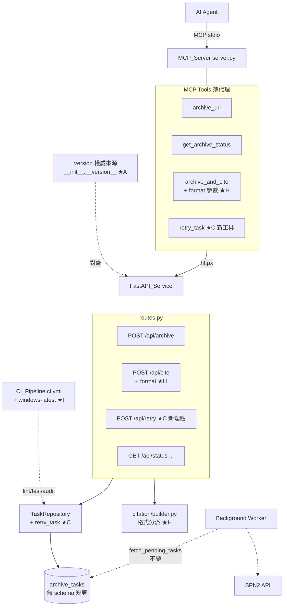
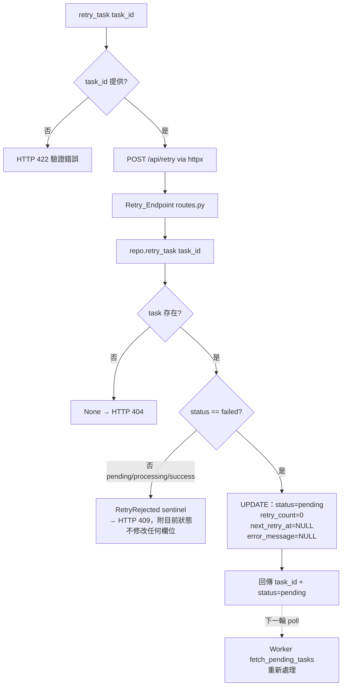
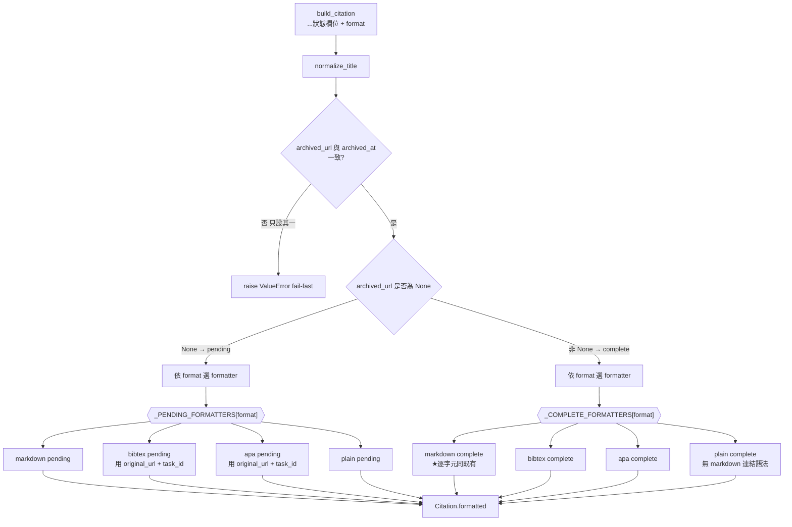
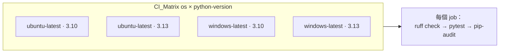
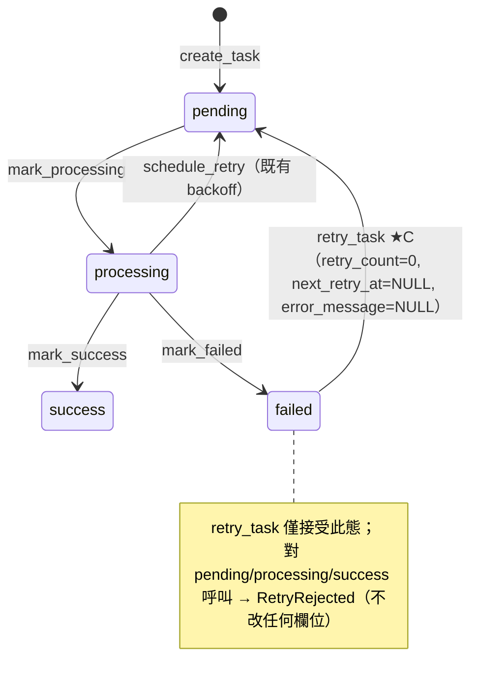

# Design Document: KeepLink v1.x Improvements（A / C / H / I）

## Overview

本設計覆蓋 KeepLink-MCP 的一批 v1.x 改進，目標版本統一為 **1.2.0**。四項改進各自獨立、彼此無耦合，且皆為既有功能的補強而非重寫；設計原則是把新增面（surface area）壓到最小，並嵌入既有雙進程架構（MCP Server stdio 薄代理 ＋ FastAPI Service ＋ 背景 Worker ＋ SQLite 佇列），維持既有行為與測試不被破壞。

| 代號 | 改進 | 觸及層 | 侵入性 |
|------|------|--------|--------|
| **A** | 版本源統一 | `__init__.py`（權威）、`pyproject.toml`、`app.py`、`README.md`、`docs/handoverbook.md`、版本一致性測試 | 純值對齊 + 測試擴充 |
| **C** | 失敗任務手動重試 `retry_task` | `repository.py`（新方法）、`routes.py`（新端點）、`server.py`（新工具）、`schemas.py`（新 schema） | 新增薄層，**無 schema 變更** |
| **H** | `archive_and_cite` 多格式 citation | `citation/builder.py`（格式分派）、`schemas.py`（`format` 欄位）、`routes.py`（傳遞）、`server.py`（`format` 參數） | 純函式擴充，向後相容 |
| **I** | CI 加 Windows matrix | `.github/workflows/ci.yml` | 純 CI 設定 |

四項改進共同遵循的核心哲學：

1. **本地優先 / 零外部依賴 / LLM-free / Deterministic**：改進 H 的格式化仍是純函式、零 I/O；不新增任何對外連線。
2. **Fail-fast**：改進 H 的非法 `format`、改進 C 的非 `failed` 狀態，皆在最早階段以明確錯誤暴露，且**先 log 再拒絕**，絕不靜默退回預設或掩蓋。
3. **Interface-first / Single Responsibility / DRY**：改進 H 以「一種格式一個 formatter」的分派結構取代把四格式塞進單一大函式；改進 C 的狀態轉換集中於 `TaskRepository.retry_task` 單一真實來源。
4. **不擴張為通用存檔器**：改進 C 只重設既有欄位讓任務重回既有 Worker 管線，不引入新的重試策略或排程；改進 H 只影響 `formatted` 字串，結構化欄位語意不變。

### 向後相容與零 schema 變更（貫穿全設計）

- **改進 C 無 DB schema 變更**：`retry_task` 只改既有 `ArchiveTask` 的欄位值（`status`、`retry_count`、`next_retry_at`、`error_message`），沿用既有 `fetch_pending_tasks` 規則讓任務重新被 Worker 撿起。
- **改進 H 向後相容**：`build_citation` 新增 **keyword-only** `format` 參數，預設 `markdown`；未指定 `format` 時輸出與本改進前**逐字元相同**（既有 markdown 格式字串原封不動搬進 `markdown` formatter）。`CiteRequest.format` 為可選欄位、預設 `markdown`。既有 `archive_url` / `get_archive_status` / `/api/archive` / `/api/cite`（不帶 format）行為完全不變。
- **改進 A** 僅對齊值與擴充測試涵蓋範圍，不改任何執行期行為。

---

## Architecture

### 四項改進在既有架構中的位置



四項改進的相依性：**彼此獨立可分開實作與驗證**。唯一的交會點是版本字串（改進 A 對齊 `app.py` 的 `version`，此值不影響改進 C/H 的行為），以及 CI（改進 I 會執行改進 A/C/H 新增的測試）。

### 改進 C：retry_task 資料流

`retry_task` 讓永久 `failed` 的任務重回 Worker 管線。關鍵：**不新增任何重試機制**，只把任務欄位重設回「乾淨的 pending 起點」，Worker 的既有 `fetch_pending_tasks`（`next_retry_at` 為 null 即可立即取出）便會重新處理。



> **設計決策：以 sentinel（三態回傳）區分「找不到」與「找到但非 failed」。**
> `retry_task` 需要讓端點回傳兩種不同的 HTTP 錯誤（404 not-found vs 409 conflict/非 failed），因此 repository 必須把這兩種情況區分開。單純回傳 `ArchiveTask | None` 無法表達第三態。方案是回傳一個明確的結果型別（見 Components）：成功 → 更新後的 `ArchiveTask`；找不到 → `None`；找到但非 failed → 一個攜帶「目前狀態」的 `RetryRejected` sentinel。這讓「非 failed 不得修改任何欄位」（Req 2.6）由 repository 在轉換前先檢查狀態來強制，fail-fast 且無副作用。

> **設計決策：冪等邊界（Req 2.9）自然成立。**
> 一旦 `retry_task` 把任務由 `failed` 重設為 `pending`，其狀態已非 `failed`；再次呼叫時 repository 的狀態檢查會走 `RetryRejected` 分支而被端點以 409 拒絕。冪等邊界不需額外旗標或欄位，是狀態轉換不變式（只有 `failed→pending`）的直接推論。

> **設計決策：重設 `retry_count=0`（Req 2.3）。**
> 手動重試代表使用者判斷「值得從頭再試一次」，因此把 `retry_count` 歸零，讓任務重新享有完整的既有 exponential-backoff 重試預算，而非沿用已耗盡的計數。`next_retry_at` 清 null 使 Worker 可立即取出（對齊既有 `recover_processing_tasks` 的作法）。

### 改進 H：多格式 citation 的分派結構

`build_citation` 的核心不變：先判定 pending vs complete（由 `archived_url` 決定），再依 `format` 選擇對應 formatter。採「格式分派 + 每格式一個純函式」的結構，避免單一大函式（single responsibility；一種格式一個 formatter）。



> **設計決策：format 分派用「兩張 formatter map（pending / complete）」而非巨型 if/elif。**
> 兩個維度（狀態 × 格式）交叉出 8 個 formatter；用 `dict[CitationFormat, Formatter]` 兩張表分派，讓「新增一種格式」= 新增一個純函式並註冊到兩張表，符合 open/closed 與 single responsibility。既有的 `_format_complete` / `_format_pending` 直接成為 `markdown` 的兩個 formatter，逐字元保留其輸出字串作為預設，確保 Req 3.2 的向後相容。

> **設計決策：非法 format 的 fail-fast 邊界在端點（Req 3.8），列舉驗證在 builder 入口。**
> HTTP 層由 Pydantic 以 `CitationFormat` 列舉驗證 `CiteRequest.format`；非法值 → 422。但為滿足「先 log 再拒絕、不得靜默退回預設」，於 `RequestValidationError` handler（或端點層顯式二次檢查）**先 `logger.warning` 記錄該非法值再回 422**（鏡射既有 `validate_url` 失敗的 `logger.warning` + `JSONResponse(422)` 模式）。`build_citation` 本身以型別（`CitationFormat` 列舉）保證只接受合法值，構成第二道防線。

> **設計決策：bibtex / apa 的 pending 態表達（Req 3.5）。**
> pending 時無 `archived_url` 亦無 `archived_at`。bibtex/apa formatter 在 pending 態改以 `original_url` 作為 URL 欄位、以 `note`/附註表達「archiving in progress, task_id=...」，確保輸出仍是合理、可貼上的引用骨架，且明確標示存檔進行中。此為既有 `_format_pending` 精神（pending 必含 original_url + task_id）在其他格式的一致延伸。

### 改進 I：CI matrix 結構



`strategy.matrix` 由單一維度（`python-version`）擴為兩維度（`os` × `python-version`），`runs-on: ${{ matrix.os }}`。GitHub Actions 的 matrix 語意天然滿足 fail-fast 的「實際執行且失敗才失敗」（Req 4.5、4.6）：每個 (os, py) 組合是一個獨立 job，任一 job 的步驟失敗只讓該 job 失敗；未被排入或未執行到的組合不影響其他 job 的通過判定。

---

## Components and Interfaces（Interface First）

### 改進 A — 版本源統一

#### 單一版本真相來源策略

- **Authoritative_Version** = `src/keeplink_mcp/__init__.py` 的 `__version__`，值設為 `"1.2.0"`（Req 1.1）。
- 其餘 Version_Source 對齊同一字串（Req 1.2–1.5）：
  - `pyproject.toml` → `version = "1.2.0"`
  - `src/keeplink_mcp/api/app.py` → `FastAPI(title="KeepLink MCP", version="1.2.0")`
  - `README.md` 頂部版本字串 → `1.2.0`
  - `docs/handoverbook.md` 版本標記 → `1.2.0`

> **設計決策：`app.py` 是否改為 import `__version__`？**
> 理想的 DRY 是讓 `app.py` 直接 `from keeplink_mcp import __version__` 並傳給 `FastAPI(version=__version__)`，消除硬編碼。但**既有的 `test_version_consistency.py` 以正則 `FastAPI\([^)]*version\s*=\s*"([^"]+)"` 讀取 `app.py` 的字面字串**——若改為變數引用，該測試的來源擷取會失效。為維持既有測試不被破壞（本批硬性約束），本設計**保留 `app.py` 的字面字串 `"1.2.0"`**，由擴充後的版本一致性測試強制它與權威來源相等。這是「維持既有測試」與「DRY」之間的取捨，選擇前者以符合「不破壞既有行為與測試」的批次約束。

#### 擴充後的版本一致性測試（Version_Consistency_Test）

**Modified File:** `test/test_version_consistency.py`

既有測試已覆蓋 `pyproject.toml` / `__init__.py` / `app.py` 三源。本改進擴充來源清單以**納入 `README.md`**（Req 1.6），並確保失敗訊息列出不一致來源與其各自版本值（Req 1.7），且每個受檢來源符合 semver（Req 1.8）。

新增擷取函式（介面契約）：

```python
def get_readme_version() -> str:
    """Extract the version string displayed at the top of README.md.

    Reads README.md and returns the first semantic-version token that
    represents the project's displayed version (e.g. a badge or a
    `Version: X.Y.Z` marker). Raises ValueError if none is found so the
    test fails loudly (fail-fast) rather than silently skipping README.

    Returns:
        The version string shown in README.md.
    """
    ...


def collect_version_sources() -> dict[str, str]:
    """Return {source_name: version_string} for every checked Version_Source.

    Sources: 'pyproject.toml', '__init__.py', 'app.py', 'README.md'.
    Central place so both the equality assertion and the failure message
    (which must list each mismatching source and its value, Req 1.7) share
    one source list.
    """
    ...
```

斷言策略：
- **相等**（Req 1.6）：`len(set(collect_version_sources().values())) == 1`；不相等時斷言訊息輸出完整 `{source: version}` dict（Req 1.7）。
- **semver 格式**（Req 1.8）：對每個來源值套用 `re.compile(r"^\d+\.\d+\.\d+$")`。

> **設計決策：README 版本擷取需 fail-fast。** 若 `README.md` 找不到版本 token，`get_readme_version` 直接 `raise ValueError`（沿用既有 `get_pyproject_version` / `get_app_version` 找不到即 raise 的模式），避免「README 未被實際檢查卻讓測試綠燈」的假陽性。

---

### 改進 C — 失敗任務手動重試

#### Component C1: `TaskRepository.retry_task`（新方法，repository.py）

**Modified File:** `src/keeplink_mcp/db/repository.py`

三態回傳以區分「找不到」/「找到但非 failed」/「成功重設」。以模組級 sentinel 表達「非 failed」態，讓端點能回不同錯誤。

```python
# 模組級 sentinel（single responsibility：只承載「非 failed」語意 + 目前狀態）
@dataclass(frozen=True)
class RetryRejected:
    """Returned when the task exists but is NOT in 'failed' status.

    Carries current_status so the endpoint can report which status blocked
    the transition (Req 2.6) without a second DB read.
    """
    current_status: TaskStatus


async def retry_task(self, task_id: str) -> ArchiveTask | RetryRejected | None:
    """Re-queue a permanently failed task by resetting it to a clean pending state.

    State-transition invariant: ONLY 'failed' -> 'pending' is permitted. No
    other status is ever modified (Req 2.6).

    Behavior:
    - Task not found                -> return None (endpoint -> 404, Req 2.7).
    - Task exists but status != failed -> return RetryRejected(current_status)
      WITHOUT modifying any field (endpoint -> 409, Req 2.6, 2.9).
    - Task status == failed         -> set status=pending, retry_count=0,
      next_retry_at=NULL, error_message=NULL; return the refreshed ArchiveTask
      (Req 2.3, 2.4). The cleared next_retry_at lets fetch_pending_tasks pick
      it up on the next poll (Req 2.5).

    Performs a status-guarded UPDATE (WHERE task_id=... AND status='failed')
    so the failed->pending transition is atomic and cannot race a concurrent
    Worker transition.
    """
    ...
```

> **設計決策：status-guarded UPDATE 保證原子性。** 轉換以 `UPDATE ... WHERE task_id=:id AND status='failed'` 執行；`rowcount == 1` 表成功、`0` 表「該筆非 failed 或不存在」，再以一次 `get_task` 判別是 `None`（不存在）或 `RetryRejected`（存在但非 failed）。避免「先讀後寫」之間 Worker 併發改狀態的競態，符合 fail-fast 且不誤改。

#### Component C2: Retry_Endpoint（新端點，routes.py）

**Modified File:** `src/keeplink_mcp/api/routes.py`（鏡射 `create_archive` 的風格：`APIRouter`、`SessionDep`、`JSONResponse` 錯誤）

```python
@router.post(
    "/retry",
    response_model=RetryResponse,
    responses={404: {"model": ErrorResponse}, 409: {"model": ErrorResponse}},
)
async def retry_task_endpoint(
    request: RetryRequest,
    session: SessionDep,
) -> RetryResponse | ErrorResponse:
    """Re-queue a permanently failed task (failed -> pending).

    Mirrors create_archive in structure. Delegates the state transition to
    TaskRepository.retry_task and maps its three-way result to HTTP:
      - ArchiveTask   -> 200 RetryResponse(task_id, status='pending') (Req 2.4)
      - RetryRejected -> 409 with detail naming current status and stating only
                         failed -> pending is allowed (Req 2.6, 2.9)
      - None          -> 404 not-found (Req 2.7)
    """
    ...
```

錯誤語意對映：

| repository 回傳 | HTTP | detail 內容 | Requirement |
|-----------------|------|-------------|-------------|
| `ArchiveTask`（已重設） | 200 | `{task_id, status: "pending"}` | 2.4, 2.5 |
| `RetryRejected(current_status)` | 409 | 指出目前狀態 + 「僅允許 failed → pending」 | 2.6, 2.9 |
| `None` | 404 | not-found | 2.7 |

#### Component C3: RetryRequest / RetryResponse schemas（新增，schemas.py）

**Modified File:** `src/keeplink_mcp/api/schemas.py`

```python
class RetryRequest(BaseModel):
    """Request body for POST /api/retry."""

    task_id: str


class RetryResponse(BaseModel):
    """Response for POST /api/retry — the re-queued task's identity + new status."""

    task_id: str
    status: str  # always "pending" on success
```

#### Component C4: `retry_task` MCP 工具（修改 server.py）

**Modified File:** `src/keeplink_mcp/mcp_server/server.py`（`list_tools` 註冊 + `call_tool` 分派 + `_handle_retry_task`，沿用既有 httpx / ConnectError 模式）

inputSchema：

```python
Tool(
    name="retry_task",
    description=(
        "Re-queue a permanently FAILED archive task so the background worker "
        "processes it again (e.g. after a transient 403/429). Only tasks whose "
        "status is 'failed' can be retried; the task is reset to 'pending' with "
        "its retry budget refreshed. Returns the task_id and new status "
        "('pending'). If the task is not failed (pending/processing/success) the "
        "call is rejected; if the task_id does not exist a not-found error is "
        "returned."
    ),
    inputSchema={
        "type": "object",
        "properties": {
            "task_id": {
                "type": "string",
                "description": "The task_id of the failed task to re-queue.",
            },
        },
        "required": ["task_id"],
    },
)
```

Handler 介面與行為（鏡射 `_handle_archive_url` 的錯誤處理）：

```python
async def _handle_retry_task(arguments: dict, base_url: str) -> list[TextContent]:
    """Handle retry_task: POST /api/retry -> return task_id + new status.

    - Missing task_id  -> {"error": "task_id is required"} (no POST).
    - Backend down     -> {"error": "Backend service unavailable"} (Req 2.8),
      catching httpx.ConnectError/ConnectTimeout exactly like existing handlers.
    - 200              -> {"task_id", "status"} JSON.
    - 404 / 409        -> {"error": detail} surfaced verbatim from backend so the
      caller sees not-found vs not-failed rejection (Req 2.6, 2.7, 2.9).
    """
    ...
```

---

### 改進 H — archive_and_cite 多種 citation 格式

#### Component H1: `CitationFormat` 列舉 + 格式分派（修改 builder.py）

**Modified File:** `src/keeplink_mcp/citation/builder.py`（維持 <500 行；純函式、零 I/O 不變）

```python
from enum import Enum


class CitationFormat(str, Enum):
    """Supported citation output formats for the `formatted` field.

    str-Enum so it serializes directly and Pydantic can validate a request
    string against it. `markdown` is the default (backward compatible).
    """

    MARKDOWN = "markdown"
    BIBTEX = "bibtex"
    APA = "apa"
    PLAIN = "plain"
```

`build_citation` 新增 keyword-only `format`（預設 `markdown`），簽章向後相容：

```python
def build_citation(
    *,
    title: str | None,
    original_url: str,
    task_id: str,
    archived_url: str | None,
    archived_at: datetime | None,
    format: CitationFormat = CitationFormat.MARKDOWN,
) -> Citation:
    """Build a Citation deterministically from the given archive state.

    `format` selects how `formatted` is rendered; it does NOT change any
    structured field (title/original_url/archived_url/archived_at/task_id keep
    their existing semantics, Req 3.10). Defaults to MARKDOWN so existing
    callers and outputs are byte-for-byte unchanged (Req 3.2).

    Contract (unchanged from before):
    - archived_url is None  -> Pending_Citation (archived_at MUST also be None).
    - archived_url not None  -> Complete_Citation (archived_at MUST be provided).
    - title is normalized via normalize_title() before use.

    Raises:
        ValueError: if (archived_url, archived_at) is inconsistent (fail-fast).
    """
    ...
```

格式分派結構（兩張 formatter map，一種格式一個純函式，single responsibility）：

```python
# Formatter 型別：complete 需五欄位；pending 只需 original_url + task_id。
# 每個 formatter 皆為 pure function，無 I/O。

def _complete_markdown(*, title, original_url, archived_url, archived_at) -> str: ...
def _complete_bibtex(*, title, original_url, archived_url, archived_at) -> str: ...
def _complete_apa(*, title, original_url, archived_url, archived_at) -> str: ...
def _complete_plain(*, title, original_url, archived_url, archived_at) -> str: ...

def _pending_markdown(*, original_url, task_id) -> str: ...
def _pending_bibtex(*, original_url, task_id) -> str: ...
def _pending_apa(*, original_url, task_id) -> str: ...
def _pending_plain(*, original_url, task_id) -> str: ...

_COMPLETE_FORMATTERS: dict[CitationFormat, CompleteFormatter] = {
    CitationFormat.MARKDOWN: _complete_markdown,
    CitationFormat.BIBTEX: _complete_bibtex,
    CitationFormat.APA: _complete_apa,
    CitationFormat.PLAIN: _complete_plain,
}
_PENDING_FORMATTERS: dict[CitationFormat, PendingFormatter] = {
    CitationFormat.MARKDOWN: _pending_markdown,
    CitationFormat.BIBTEX: _pending_bibtex,
    CitationFormat.APA: _pending_apa,
    CitationFormat.PLAIN: _pending_plain,
}
```

- **向後相容核心**：`_complete_markdown` / `_pending_markdown` 的字串**逐字元等於**既有 `_format_complete` / `_format_pending`（既有函式收攏為 markdown formatter，輸出不動）。
- **plain（Req 3.4）**：不含任何 markdown 連結語法（無 `[text](url)`）。complete 範例：`{title 或 archived_url}. Original: {original_url}. Archived: {YYYY-MM-DD}. Archived URL: {archived_url}`。
- **bibtex（Req 3.5 pending）**：complete 用 `@misc{...}` 含 `title`/`url = {archived_url}`/`note = {Archived YYYY-MM-DD; original: ...}`；pending 用 `url = {original_url}`、`note = {Archiving in progress; task_id: ...}`。
- **apa（Req 3.5 pending）**：complete 形如 `{title}. Retrieved YYYY-MM-DD, from {archived_url} (original: {original_url})`；pending 形如 `{title 或 original_url}. Archiving in progress (task_id: ...); original: {original_url}`。
- **確定性**：所有 formatter 僅由入參與 `strftime("%Y-%m-%d")` 推導，無隨機、無 locale 相依、無 I/O。

#### Component H2: `CiteRequest.format` 欄位（修改 schemas.py）

```python
class CiteRequest(BaseModel):
    """Request body for POST /api/cite."""

    url: str
    title: str | None = None  # whitespace-only normalized to None at endpoint
    format: CitationFormat = CitationFormat.MARKDOWN  # invalid value -> 422
```

- Pydantic 以 `CitationFormat` 列舉驗證：非列舉值在請求解析階段即 422（Req 3.8 的第一道防線）。`CitationResponse` 不變（`format` 只影響 `formatted`，Req 3.10）。

#### Component H3: Cite_Endpoint 傳遞 format（修改 routes.py）

`create_citation` 於呼叫 `build_citation` 時多傳 `format=request.format`（兩個分支——cache-hit complete 與 pending/create——皆傳遞）。

```python
citation = build_citation(
    title=title,
    original_url=...,
    task_id=...,
    archived_url=archived_url,
    archived_at=archived_at,
    format=request.format,   # ★H 傳遞；預設 markdown 已由 schema 保證
)
```

> **Req 3.8 / 3.11 的落點**：因 `CiteRequest.format` 為 `CitationFormat` 列舉，非法字串在 FastAPI 請求驗證期即被擋下回 422（fail-fast，不建 Citation）。為滿足「先 log 再拒絕」，於 `app.py` 掛一個針對 `RequestValidationError` 的 handler（或在端點層對 format 做顯式二次檢查）**先 `logger.warning` 記錄非法 format 值再回 422**。Req 3.11「只有經處理並確實呼叫 builder 後才回 `CitationResponse`」由既有流程結構保證：任一前置錯誤都走 `JSONResponse`/驗證錯誤路徑，永不產生 `CitationResponse`。

#### Component H4: archive_and_cite 工具新增 format 參數（修改 server.py）

`archive_and_cite` 的 `inputSchema.properties` 新增可選 `format`：

```python
"format": {
    "type": "string",
    "enum": ["markdown", "bibtex", "apa", "plain"],
    "description": (
        "Citation output format for the `formatted` field. One of markdown "
        "(default), bibtex, apa, plain. Only affects `formatted`; structured "
        "fields are unchanged."
    ),
},
```

`_handle_archive_and_cite` 於 payload 帶上 `format`（有提供才帶，讓後端預設生效）：

```python
payload: dict[str, str] = {"url": validated_url}
if title is not None:
    payload["title"] = title
fmt = arguments.get("format")
if fmt is not None:
    payload["format"] = fmt   # 後端以列舉驗證；非法值 -> 422 -> {"error": detail}
```

- 非法 format 由後端 422 回傳，工具沿用既有「非 2xx → `{"error": detail}`」路徑上呈；不在工具層靜默改預設（fail-fast 一致）。

---

### 改進 I — CI 加入 Windows matrix

**Modified File:** `.github/workflows/ci.yml`

```yaml
jobs:
  test:
    runs-on: ${{ matrix.os }}
    strategy:
      fail-fast: false          # 各平台獨立評估：一平台失敗不取消另一平台（Req 4.5、4.6）
      matrix:
        os: [ubuntu-latest, windows-latest]
        python-version: ["3.10", "3.13"]
    steps:
      - uses: actions/checkout@v5
      - uses: actions/setup-python@v6
        with:
          python-version: ${{ matrix.python-version }}
      - name: Install dependencies
        run: |
          pip install --upgrade "setuptools>=83.0.0"
          pip install -e ".[dev]" pip-audit
      - name: Lint
        run: ruff check src/ test/
      - name: Test
        run: pytest test/ -v
      - name: Security audit
        run: pip-audit --skip-editable
```

- `os × python-version` = 4 個 job（Req 4.1、4.2）。每個 job 皆執行 lint/test/audit 三步（Req 4.3、4.4）。
- `fail-fast: false` 確保 Windows 的失敗不會取消 Ubuntu job（反之亦然），符合「實際執行且失敗才失敗、不因單一平台通過而掩蓋另一平台失敗」（Req 4.5）與「僅就實際執行到的步驟評估」（Req 4.6）。
- **跨平台注意**：`Install dependencies` 的多行 `run` 在 Windows runner 預設以 PowerShell 執行；上述 pip 指令為跨 shell 相容的單純指令，無需 shell 特定語法。

> **設計決策：不新增平台條件分支。** 三個步驟在兩平台跑相同指令即可（`ruff`/`pytest`/`pip-audit` 皆跨平台），無需 `if: runner.os == ...`。改進 I 的價值正是讓既有測試（含改進 A 版本測試路徑拼接、port 綁定等）在 Windows 上真的跑一遍。

---

## Data Models

### 無資料庫 schema 變更（全批次）

四項改進**皆無** DB migration：

| 改進 | 資料面影響 |
|------|-----------|
| A | 無資料面；僅字串常數與測試 |
| C | 只 **更新** 既有 `ArchiveTask` 欄位值（`status`/`retry_count`/`next_retry_at`/`error_message`），不新增欄位、不新增表 |
| H | 無資料面；`format` 只是請求參數，影響輸出字串，不入庫 |
| I | 無資料面 |

### 改進 C 的狀態轉換模型

`retry_task` 是既有 `ArchiveTask` 生命週期上新增的一條**受限**轉換邊，只允許 `failed → pending`：



重設後的欄位值（成功路徑）：

| 欄位 | 重設後值 | 理由 |
|------|----------|------|
| `status` | `pending` | 重回 Worker 佇列 |
| `retry_count` | `0` | 手動重試恢復完整 backoff 預算（Req 2.3） |
| `next_retry_at` | `NULL` | 使 `fetch_pending_tasks` 立即可取（Req 2.5） |
| `error_message` | `NULL` | 清除前次失敗訊息，避免誤導 |
| `updated_at` | 現在時間 | 沿用既有 `onupdate`/顯式 set 慣例 |
| `url` / `task_id` / `created_at` / `result_url` | **不變** | 任務身分與歷史保留 |

### 改進 H 的 Citation 形態 × 格式（不動 schema，只擴 formatted）

`Citation` dataclass 與 `CitationResponse` schema 的欄位**完全不變**；`format` 僅決定 `formatted` 字串的呈現。兩種狀態 × 四種格式 = 8 種 `formatted` 輸出，其餘欄位語意固定（Req 3.10）。

| 狀態 | `archived_url` / `archived_at` | 各格式 `formatted` 來源欄位 |
|------|-------------------------------|-----------------------------|
| Complete | 皆非 null | markdown/bibtex/apa/plain 皆用 title/original_url/archived_url/archived_at |
| Pending | 皆 null | 四格式皆用 original_url + task_id（bibtex/apa 以 note/附註表達進行中） |

### 新增 / 修改檔案摘要

| 檔案 | 類型 | 改進 | 用途 |
|------|------|------|------|
| `src/keeplink_mcp/__init__.py` | 修改 | A | `__version__ = "1.2.0"`（權威） |
| `pyproject.toml` | 修改 | A | `version = "1.2.0"` |
| `src/keeplink_mcp/api/app.py` | 修改 | A | `FastAPI(version="1.2.0")` |
| `README.md` | 修改 | A | 頂部版本字串 → 1.2.0 |
| `docs/handoverbook.md` | 修改 | A | 版本標記 → 1.2.0；記錄 retry_task 與多格式 |
| `test/test_version_consistency.py` | 修改 | A | 納入 README 來源、失敗列出來源值、semver 檢查 |
| `src/keeplink_mcp/db/repository.py` | 修改 | C | 新增 `retry_task` + `RetryRejected` sentinel |
| `src/keeplink_mcp/api/routes.py` | 修改 | C, H | 新增 `POST /api/retry`；`create_citation` 傳 `format` |
| `src/keeplink_mcp/api/schemas.py` | 修改 | C, H | 新增 `RetryRequest`/`RetryResponse`；`CiteRequest.format` |
| `src/keeplink_mcp/mcp_server/server.py` | 修改 | C, H | 新增 `retry_task` 工具/handler；`archive_and_cite` 加 `format` |
| `src/keeplink_mcp/citation/builder.py` | 修改 | H | `CitationFormat` 列舉 + 格式分派（8 formatter） |
| `.github/workflows/ci.yml` | 修改 | I | matrix 加 `os: [ubuntu-latest, windows-latest]` |

無新增執行期模組、無 model 變更、無 config 變更。

---

## Correctness Properties

*A property is a characteristic or behavior that should hold true across all valid executions of a system — essentially, a formal statement about what the system should do. Properties serve as the bridge between human-readable specifications and machine-verifiable correctness guarantees.*

本批四項改進中，**改進 H 的 `Citation_Builder`**（純確定性函式）與**改進 C 的 `retry_task` 狀態轉換**（狀態機不變式）非常適合 property-based testing（hypothesis）；**改進 A 的版本一致性**是跨來源的相等 + 格式不變式（沿用既有 Property 7 的形態）。**改進 I**為 CI 設定與平台語意，無可屬性化的程式邏輯，改以 SMOKE / INTEGRATION 驗收（見 Testing Strategy）。

以下屬性經 prework 分析與去重整併（consolidation）而得，每條各自提供獨立驗證價值。

### Property 1: 版本一致性與 semver 格式（Version Consistency & Semver）

*For all* checked Version_Sources（`pyproject.toml`、`__init__.py`、`app.py`、`README.md`），其版本字串 SHALL 全部相等（唯一值集合大小為 1）；且每個來源的版本字串 SHALL 符合 `^\d+\.\d+\.\d+$`。當不相等時，失敗訊息 SHALL 列出每個來源與其各自版本值。

**Validates: Requirements 1.1, 1.2, 1.3, 1.4, 1.6, 1.7, 1.8**

### Property 2: retry 重設不變式（Failed → Pending Reset Invariant）

*For any* `failed` ArchiveTask with arbitrary initial `retry_count`、`next_retry_at`、`error_message`，calling `retry_task` SHALL result in `status == pending`、`retry_count == 0`、`next_retry_at is None`、`error_message is None`，且回傳任務的 `task_id` 等於原 `task_id`。

**Validates: Requirements 2.3, 2.4**

### Property 3: 非 failed 一律拒絕且不改任何欄位（Non-failed Rejected, No Mutation）

*For any* ArchiveTask whose status is NOT `failed`（即 `pending` / `processing` / `success`，含任意其他欄位值），calling `retry_task` SHALL return `RetryRejected(current_status)` 並使該任務**所有欄位**（`status`、`retry_count`、`next_retry_at`、`error_message`、`result_url`、`updated_at` 等）與呼叫前逐一相等（無任何副作用）。

**Validates: Requirements 2.6**

### Property 4: 重試冪等邊界（Retry Idempotence Boundary）

*For any* `failed` ArchiveTask，先呼叫一次 `retry_task`（成功轉為 `pending`）後再次呼叫 `retry_task`，第二次呼叫 SHALL 回傳 `RetryRejected(current_status == pending)`，且第二次呼叫不改變該任務任何欄位。

**Validates: Requirements 2.9**

### Property 5: markdown 預設向後相容（Markdown Default Byte-for-byte Compatibility）

*For any* combination of archive state（pending 或 complete）與 `title`（含 None、whitespace、一般字串），`build_citation(...)`（不傳 `format`）產生的 `formatted` SHALL 與 `build_citation(..., format=CitationFormat.MARKDOWN)` 完全相同，且等於本改進前既有 markdown 格式邏輯（`_format_complete` / `_format_pending`）的輸出（逐字元相同）。

**Validates: Requirements 3.2**

### Property 6: 多格式確定性（Multi-format Determinism）

*For any* combination of `format`（四種）、archive state（兩態）、`title`、`original_url`、`archived_url`、`archived_at`、`task_id`，多次呼叫 `build_citation` SHALL 產生完全相同的 `Citation`（所有欄位含 `formatted` 逐一相等）。

**Validates: Requirements 3.1, 3.3**

### Property 7: 兩態 × 四格式完整性（Two-state × Four-format Completeness）

*For any* archive state（pending 或 complete）與任一 `format`（markdown/bibtex/apa/plain），`build_citation` SHALL 皆產生一個非空的 `formatted` 字串（每種狀態 × 格式組合皆有合理輸出，無未涵蓋組合、無例外）。

**Validates: Requirements 3.1**

### Property 8: plain 格式不含 markdown 連結語法（Plain Has No Markdown Link Syntax）

*For any* archive state 與 `title`，當 `format == plain` 時，`formatted` SHALL 不含任何 markdown 連結語法（不出現 `](` 這類 `[text](url)` 結構）。

**Validates: Requirements 3.4**

### Property 9: pending 態 bibtex/apa 以 original_url + task_id 表達進行中（Pending Bibtex/APA Fallback）

*For any* pending citation（`archived_url is None`）與 `format ∈ {bibtex, apa}`，`formatted` SHALL 同時包含 `original_url` 與 `task_id`，並明確標示存檔進行中（不虛構 `archived_url`）。

**Validates: Requirements 3.5**

### Property 10: 結構化欄位不受 format 影響（Structured Fields Format-invariant）

*For any* inputs 與任一 `format`，`build_citation` 回傳的結構化欄位（`title`、`original_url`、`archived_url`、`archived_at`、`task_id`）SHALL 與 `format=markdown` 時相同；`format` 只影響 `formatted`。

**Validates: Requirements 3.10**

### Property 11: 端點 format 端到端一致（Endpoint Format End-to-end Consistency）

*For any* valid `format` 與任一任務狀態，`POST /api/cite` 回應中的 `CitationResponse.formatted` SHALL 等於以相同狀態與 `format` 呼叫 `build_citation` 所得的 `formatted`。

**Validates: Requirements 3.9**

### Property 12: 非法 format fail-fast 且不產生 CitationResponse（Invalid Format Rejected, No Citation）

*For any* `format` 字串不在有效列舉值之內，`POST /api/cite` SHALL 回傳 HTTP 422 驗證錯誤、SHALL NOT 產生 `CitationResponse`、且 SHALL NOT 靜默退回預設格式（先於內部 log 該非法值再拒絕）。

**Validates: Requirements 3.8, 3.11**

### Property 13: Citation_Builder 無 I/O 純粹性（No-I/O Purity）

*For any* inputs to `build_citation` / formatter functions / `normalize_title`，產生 `Citation` 的過程 SHALL 不執行任何網路請求、頁面抓取、LLM 呼叫或 DB 存取。

**Validates: Requirements 3.3**

---

## Error Handling

錯誤處理全面沿用 codebase 既有慣例：驗證失敗於最早階段 fail-fast、backend 通訊錯誤統一為單一使用者可理解訊息、純函式層以例外暴露不可能狀態而非靜默容錯、拒絕前先 log。

| 情境 | 層 | 行為 | Requirement |
|------|----|------|-------------|
| retry：`task_id` 缺失 | MCP Tool | 回 `{"error": "task_id is required"}`，不 POST | 2.1 |
| retry：backend 不可達 | MCP Tool | 捕捉 `httpx.ConnectError`/`ConnectTimeout` → `{"error": "Backend service unavailable"}`（與既有 handler 逐字一致） | 2.8 |
| retry：任務不存在 | Retry_Endpoint | `repo.retry_task` 回 `None` → `JSONResponse(404, {"detail": "Task not found"})` | 2.7 |
| retry：任務非 failed | Retry_Endpoint | 回 `RetryRejected(current_status)` → `JSONResponse(409, {"detail": "Cannot retry task in status '<status>'; only failed -> pending is allowed"})`，**不改任何欄位** | 2.6, 2.9 |
| retry：任務為 failed | Retry_Endpoint / Repository | status-guarded UPDATE 重設四欄位 → 200 `RetryResponse` | 2.3, 2.4, 2.5 |
| cite：非法 `format` | Cite_Endpoint | `RequestValidationError`（Pydantic 列舉驗證）→ `logger.warning(非法值)` 後 `JSONResponse(422, ...)`；不建 Citation、不退預設 | 3.8, 3.11 |
| cite：非法 URL | Cite_Endpoint | `JSONResponse(422, {"detail": "Invalid URL: ..."})`，不建任務（既有行為不變） | 3.11 |
| cite：MCP 層轉發非 2xx | MCP Tool | 沿用「非 2xx → `{"error": detail}`」；非法 format 的 422 由此上呈，不在工具層改預設 | 3.8 |
| builder：`archived_url`/`archived_at` 只設其一 | Citation_Builder | `raise ValueError`（fail-fast，不以 fallback 掩蓋；既有行為不變） | 3.10 |
| builder：非法 `format`（型別外） | Citation_Builder | 以 `CitationFormat` 列舉型別為第二道防線；分派 map 對未知鍵 fail-fast（不靜默預設） | 3.8 |
| 版本來源缺版本 token | Version_Consistency_Test | `get_readme_version` 等擷取函式 `raise ValueError`，使測試明確失敗而非假綠燈 | 1.6, 1.7 |
| CI：任一平台步驟失敗 | CI_Pipeline | `fail-fast: false`，該平台 job 標記失敗、不取消/掩蓋其他平台 | 4.5, 4.6 |

---

## Testing Strategy

採 **property-based tests（hypothesis）+ example/golden unit tests + integration/smoke** 三層分工。測試檔置於 `test/`（依專案慣例），文件置於 `docs/`。

### 分工原則

- **Property tests（hypothesis）**：驗證跨大量輸入的通用不變式——純函式格式化（改進 H）、狀態轉換不變式（改進 C）、版本一致性（改進 A）。
- **Golden / example unit tests**：驗證每種 (格式 × 狀態) 的具體字面輸出（防字面回歸）、工具/schema 註冊結構、具體邊界（not-found、缺參數、backend down）。
- **Integration / smoke**：驗證與既有 Worker 的接線（retry 後被 `fetch_pending_tasks` 撿起）、CI 於各平台實跑三步驟。

### Property-Based Tests（hypothesis）

- 使用專案既有的 **hypothesis**（`.hypothesis/` 已存在，不自行實作 PBT 框架）。
- 每個 property test 最少 **100 iterations**。
- 每個測試以註解標註對應設計屬性，格式：`# Feature: keeplink-v1x-improvements, Property {number}: {property_text}`。
- 每條 Correctness Property 對應 **單一** property-based test。

落點與對應：

| 測試檔 | 涵蓋屬性 | 說明 |
|--------|----------|------|
| `test/test_version_consistency.py`（擴充） | Property 1 | 納入 README 來源；不相等時列出 `{source: version}`；semver 檢查 |
| `test/test_citation_builder_properties.py`（擴充/新增） | Property 5, 6, 7, 8, 9, 10, 13 | 純函式 `build_citation` 的多格式屬性 |
| `test/test_retry_repository_properties.py`（新增） | Property 2, 3, 4 | in-memory SQLite，隨機初始欄位 / 狀態的 retry 轉換不變式 |
| `test/test_cite_endpoint_properties.py`（擴充） | Property 11, 12 | ASGI test client，隨機 format + 任務狀態；非法 format → 422 |

### Strategies（需覆蓋的輸入空間）

- **format**：`markdown` / `bibtex` / `apa` / `plain`（四值全覆蓋）；另生成**不在列舉的隨機字串**供 Property 12。
- **archive state（兩態）**：complete（`archived_url` 非 null + timezone-aware `archived_at`，跨月/跨年/單位數月日）與 pending（皆 null）皆需生成。
- **title**：`None`、空字串、純 whitespace（含 `\t`、全形空白 U+3000）、含 Unicode 與 markdown 特殊字元（`[`、`]`、`(`、`)`）的一般字串。
- **original_url / archived_url**：合法 http/https URL。
- **task_id**：任意 hex 字串。
- **task status（改進 C）**：`failed`（Property 2、4）與 `pending`/`processing`/`success`（Property 3）；並生成任意初始 `retry_count`（含 >0）、任意 `next_retry_at`（含非 null）、任意 `error_message`（含非 null）以驗證重設不變式。
- **version 來源（改進 A）**：以實際檔案讀取；semver 格式屬性對每個來源值套用正則。

### Example / Golden Unit Tests

聚焦具體範例、邊界與非 input-varying 行為：

- **改進 A**：`__version__ == "1.2.0"`；handoverbook 版本標記（文件審查 / doc-presence）。
- **改進 C 工具與 schema**：`list_tools()` 含 `retry_task`、`inputSchema.required == ["task_id"]`（Req 2.1）；`POST /api/retry` 存在（Req 2.2）；not-found → 404（Req 2.7）；缺 `task_id` 與 backend down → 對應 error（Req 2.8）；非 failed 拒絕的一個具體範例訊息含目前狀態。
- **改進 H 工具與 schema**：`archive_and_cite` inputSchema 的 `format` enum == 四值且非必填（Req 3.7）；`CiteRequest(url=...).format == MARKDOWN`（Req 3.6）；每種 (格式 × 狀態) 各一個 golden `formatted` 字串範例（8 條，輔助 property test 抓字面回歸）；非法 format 先 log 再 422 以 `caplog` 驗證（Req 3.8 的 log 面）。

### Integration / Smoke

- **改進 C（Req 2.5）**：重設一個 `failed` 任務後，斷言它出現在 `fetch_pending_tasks()` 結果中（1–2 例，驗證與既有 Worker 撿取規則的接線）。
- **改進 I（Req 4.1–4.6）**：CI 本身即為驗證——`ci.yml` 的 `matrix.os` 含 `ubuntu-latest` 與 `windows-latest`、`python-version` 為 `["3.10","3.13"]`（設定檢視 / SMOKE）；每個 job 於各自平台實跑 `ruff check` / `pytest` / `pip-audit`，任一步驟失敗即該 job 失敗（`fail-fast: false` 確保平台間不互相取消，INTEGRATION 由實跑證明）。改進 I 無需新增專屬測試檔——它讓改進 A/C/H 的既有與新增測試在 Windows 上真的跑一遍。

### Lint 與 Test 執行（最終任務）

- 執行 `ruff check src/ test/` 與完整 `pytest test/`（property tests 以 hypothesis 執行 ≥100 iterations）。
- 由使用者於終端手動執行長時程或 watch 模式指令；CI（`.github/workflows/ci.yml`，含新增 Windows matrix）作為最終跨平台把關。

---

## Requirements Traceability

| Requirement | Acceptance Criteria | 設計覆蓋（Component / Property / 驗證方式） |
|-------------|--------------------|-------------------------------------------|
| 1. 版本源統一（A） | 1.1 | `__init__.__version__="1.2.0"`；Property 1 / example |
| | 1.2 | `pyproject.toml`；Property 1 |
| | 1.3 | `app.py` FastAPI version；Property 1 |
| | 1.4 | README 版本；Property 1（新增來源） |
| | 1.5 | handoverbook 版本標記；doc 審查（SMOKE） |
| | 1.6 | `collect_version_sources` 四源相等；Property 1 |
| | 1.7 | 失敗列出 `{source: version}`；Property 1 |
| | 1.8 | 每源 semver 檢查；Property 1 |
| 2. retry_task（C） | 2.1 | Component C4 `list_tools` 註冊；example |
| | 2.2 | Component C2 `POST /api/retry`；example |
| | 2.3 | Component C1 重設四欄位；Property 2 |
| | 2.4 | Component C2 回 task_id+pending；Property 2 |
| | 2.5 | 沿用 `fetch_pending_tasks`；INTEGRATION |
| | 2.6 | Component C1 `RetryRejected` 不改欄位；Property 3 |
| | 2.7 | Component C2 `None`→404；example |
| | 2.8 | Component C4 ConnectError 處理；example |
| | 2.9 | 冪等邊界；Property 4 |
| 3. 多格式 citation（H） | 3.1 | Component H1 四格式；Property 6, 7 |
| | 3.2 | Component H1 markdown 預設；Property 5 |
| | 3.3 | Component H1 確定性 + 無 I/O；Property 6, 13 |
| | 3.4 | Component H1 plain formatter；Property 8 |
| | 3.5 | Component H1 pending bibtex/apa；Property 9 |
| | 3.6 | Component H2 `CiteRequest.format` 預設；example |
| | 3.7 | Component H4 inputSchema format enum；example |
| | 3.8 | Component H3 fail-fast + log；Property 12 / caplog example |
| | 3.9 | Component H3 端點傳遞 format；Property 11 |
| | 3.10 | Component H1 結構欄位不變；Property 10 |
| | 3.11 | Component H3 僅處理後產生；Property 12 |
| 4. CI Windows matrix（I） | 4.1 | `ci.yml` matrix.os 兩平台；SMOKE |
| | 4.2 | matrix.python-version 3.10/3.13；SMOKE |
| | 4.3 | windows job 三步驟；INTEGRATION（CI 實跑） |
| | 4.4 | ubuntu job 三步驟回歸；INTEGRATION |
| | 4.5 | `fail-fast: false` 平台獨立；SMOKE |
| | 4.6 | matrix job 獨立評估；SMOKE |

所有 acceptance criteria 皆有對應設計元件與驗證策略：可屬性化邏輯以 Property 1–13 覆蓋（改進 A 版本一致性、改進 C 狀態轉換、改進 H 多格式純函式與端點一致性），其餘以 example/golden unit test、integration 或 CI/doc smoke 覆蓋。改進 I 依專案哲學（IaC/CI 設定不適用 PBT）不設 property，由 CI 自身執行與設定檢視驗收。
