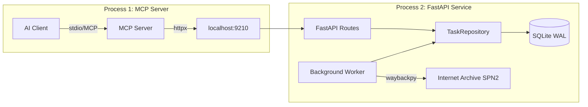
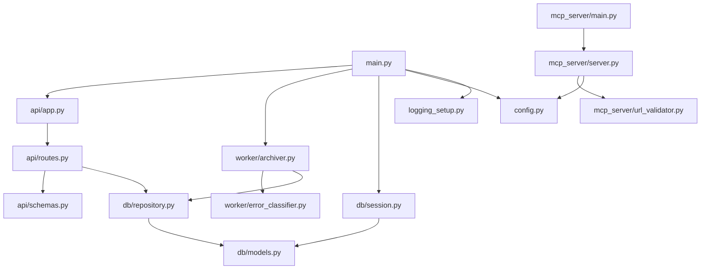
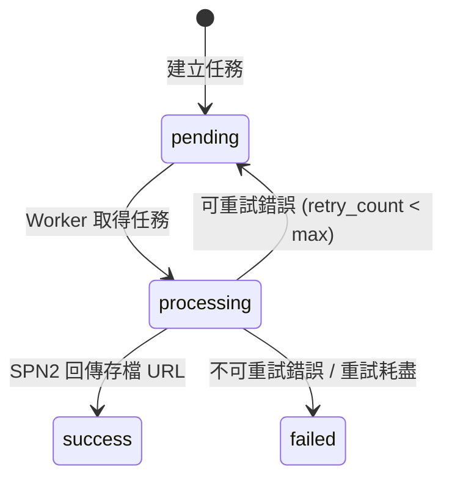

# Design Document: OmniArchive MCP

## Overview

OmniArchive MCP 採用雙進程架構，將 MCP Server 與 FastAPI Service 解耦為兩個獨立進程：

1. **FastAPI Service 進程**（`omniarchive_mcp.main`）：啟動 FastAPI HTTP 服務 + Background Worker，負責任務佇列管理、持久化、背景處理
2. **MCP Server 進程**（`omniarchive_mcp.mcp_server.main`）：透過 stdio 與 AI Client 通訊，透過 httpx 呼叫 FastAPI Service 的內部 API

兩進程透過 `localhost:9210` 的內部 HTTP API 通訊，MCP Server 是無狀態的薄代理層。

## Architecture



### 進程間通訊

- MCP Server → FastAPI Service：透過 httpx 的 async HTTP client
- 所有狀態存儲於 SQLite，MCP Server 不保留任何本地狀態
- FastAPI Service 綁定 `127.0.0.1:9210`，僅接受本地連接

### 啟動順序

1. FastAPI Service 進程：初始化 DB → 啟動 FastAPI → 啟動 Background Worker
2. MCP Server 進程：獨立啟動，透過 httpx 連接 FastAPI Service

## Components and Interfaces

### 模組依賴圖



### 內部 HTTP API 契約

#### POST /api/archive

提交 URL 存檔請求。

**Request:**
```json
{
  "url": "https://example.com/page"
}
```

**Response (201 Created):**
```json
{
  "task_id": "a1b2c3d4...",
  "url": "https://example.com/page",
  "status": "pending",
  "created_at": "2024-01-01T00:00:00Z",
  "is_deduplicated": false
}
```

**Response (200 OK — 去重命中):**
```json
{
  "task_id": "existing-id...",
  "url": "https://example.com/page",
  "status": "success",
  "result_url": "https://web.archive.org/web/...",
  "created_at": "2024-01-01T00:00:00Z",
  "is_deduplicated": true
}
```

**Error (422):**
```json
{
  "detail": "Invalid URL: scheme must be http or https"
}
```

#### GET /api/status/{task_id}

按 task_id 查詢任務狀態。

**Response (200):**
```json
{
  "task_id": "a1b2c3d4...",
  "url": "https://example.com/page",
  "status": "success",
  "result_url": "https://web.archive.org/web/...",
  "error_message": null,
  "retry_count": 0,
  "created_at": "2024-01-01T00:00:00Z",
  "updated_at": "2024-01-01T00:00:05Z"
}
```

**Error (404):**
```json
{
  "detail": "Task not found"
}
```

#### GET /api/status?url={encoded_url}

按 URL 查詢最近任務狀態。

**Response:** 同 GET /api/status/{task_id}

**Error (404):**
```json
{
  "detail": "No tasks found for this URL"
}
```

### 模組介面定義

#### `mcp_server/url_validator.py`

```python
class ValidationError(ValueError):
    """URL validation failure with descriptive message."""
    pass

def validate_url(raw: str) -> str:
    """Validate and normalize a URL.
    
    Args:
        raw: Raw URL string from user input.
    
    Returns:
        Normalized URL string (stripped, scheme-verified, host-verified).
    
    Raises:
        ValidationError: If URL is invalid.
    """
```

#### `worker/error_classifier.py`

```python
from enum import Enum

class ErrorCategory(Enum):
    RETRYABLE = "retryable"
    NON_RETRYABLE = "non_retryable"

def classify_error(exception: Exception) -> ErrorCategory:
    """Classify an archive error as retryable or non-retryable.
    
    Args:
        exception: The exception raised during SPN2 API call.
    
    Returns:
        ErrorCategory indicating retry strategy.
    """
```

#### `worker/archiver.py`

```python
class BackgroundWorker:
    """Polls pending tasks and processes them via SPN2 API."""
    
    def __init__(self, config: Config, session_factory, logger):
        ...
    
    async def start(self) -> None:
        """Start the polling loop. Runs until cancelled."""
    
    async def stop(self) -> None:
        """Gracefully stop: finish current task, then exit loop."""
    
    async def _poll_and_process(self) -> None:
        """Single poll cycle: fetch pending tasks, process up to concurrency limit."""
    
    async def _process_task(self, task: ArchiveTask) -> None:
        """Process a single task: call SPN2, handle result/error."""
    
    def _calculate_backoff(self, retry_count: int) -> float:
        """Calculate backoff delay: base_backoff_sec * 2^retry_count."""
```

#### `api/schemas.py`

```python
from pydantic import BaseModel
from datetime import datetime

class ArchiveRequest(BaseModel):
    url: str

class ArchiveResponse(BaseModel):
    task_id: str
    url: str
    status: str
    result_url: str | None = None
    created_at: datetime
    is_deduplicated: bool = False

class TaskStatusResponse(BaseModel):
    task_id: str
    url: str
    status: str
    result_url: str | None = None
    error_message: str | None = None
    retry_count: int
    created_at: datetime
    updated_at: datetime

class ErrorResponse(BaseModel):
    detail: str
```

#### `mcp_server/server.py`

```python
class OmniArchiveMCPServer:
    """MCP Server exposing archive_url and get_archive_status tools."""
    
    def __init__(self, config: Config):
        ...
    
    # Tool: archive_url
    # Parameters: url (str, required)
    # Returns: {task_id, status, url}
    
    # Tool: get_archive_status
    # Parameters: task_id (str, optional), url (str, optional) — at least one required
    # Returns: {task_id, status, result_url, error_message, ...}
```

## Data Models

### ArchiveTask（更新後）

| 欄位 | 類型 | 說明 |
|------|------|------|
| task_id | String(32), PK | UUID hex，自動生成 |
| url | Text, indexed | 目標 URL |
| status | Enum(TaskStatus) | pending/processing/success/failed |
| retry_count | Integer | 重試次數，預設 0 |
| next_retry_at | DateTime(tz), nullable | 下次可重試時間，null 表示立即可處理 |
| created_at | DateTime(tz) | 任務建立時間 |
| updated_at | DateTime(tz) | 最後更新時間 |
| result_url | Text, nullable | 存檔成功後的 Wayback URL |
| error_message | Text, nullable | 最後一次錯誤訊息 |

### 狀態機



### Config 更新

新增欄位：
```python
worker_concurrency: int = int(os.getenv("OMNIARCHIVE_WORKER_CONCURRENCY", "1"))
```

### 去重查詢邏輯

```python
async def find_recent_task(self, url: str, window_hours: int = 24) -> ArchiveTask | None:
    """Find most recent task for URL within dedup window.
    
    Returns the task if status is pending/processing/success.
    Returns None if only failed tasks or no tasks exist within window.
    """
```

### fetch_pending_tasks 更新

```python
async def fetch_pending_tasks(self, limit: int = 10) -> list[ArchiveTask]:
    """Fetch pending tasks that are ready to process.
    
    Filters: status == PENDING AND (next_retry_at IS NULL OR next_retry_at <= now())
    """
```

## Correctness Properties

*A property is a characteristic or behavior that should hold true across all valid executions of a system — essentially, a formal statement about what the system should do. Properties serve as the bridge between human-readable specifications and machine-verifiable correctness guarantees.*

### Property 1: URL 驗證 round-trip 一致性

*For any* valid URL string (containing http/https scheme and a hostname with at least one dot), passing it through `validate_url` SHALL return a normalized string that, when passed through `validate_url` again, produces the same result (idempotence).

**Validates: Requirements 3.1, 3.2, 3.5**

### Property 2: 無效 URL 一律被拒絕

*For any* string that does not contain a valid http/https scheme or lacks a hostname with at least one dot, `validate_url` SHALL raise a `ValidationError`.

**Validates: Requirements 3.3, 3.4**

### Property 3: 錯誤分類的完整性

*For any* HTTP status code returned by SPN2 API, `classify_error` SHALL categorize it as either retryable or non-retryable, with 429/5xx/network errors as retryable, and 401/403 as non-retryable.

**Validates: Requirements 8.1, 8.2, 8.3, 8.4, 8.5**

### Property 4: 指數退避計算正確性

*For any* retry_count in [0, max_retries), the calculated backoff delay SHALL equal `base_backoff_sec * 2^retry_count`, producing a strictly monotonically increasing sequence.

**Validates: Requirements 7.2**

### Property 5: 去重窗口內的冪等性

*For any* URL submitted multiple times within the dedup window, if a pending/processing/success task already exists, the system SHALL return the existing task_id without creating a new task — the total task count for that URL SHALL not increase.

**Validates: Requirements 4.1, 4.2**

### Property 6: 去重窗口內失敗任務允許重試

*For any* URL submitted when the only existing task within the dedup window has status "failed", the system SHALL create a new task — the total task count for that URL SHALL increase by one.

**Validates: Requirements 4.3**

### Property 7: Worker 跳過未到期的重試任務

*For any* set of pending tasks where some have `next_retry_at` in the future, `fetch_pending_tasks` SHALL only return tasks where `next_retry_at` is null or in the past.

**Validates: Requirements 6.6, 7.4**

### Property 8: 任務狀態轉換合法性

*For any* ArchiveTask, the only valid state transitions are: pending→processing, processing→success, processing→pending (retry), processing→failed. No other transitions SHALL occur.

**Validates: Requirements 6.2, 6.3, 7.3**

## Error Handling

### 分層錯誤處理策略

| 層級 | 錯誤類型 | 處理方式 |
|------|----------|----------|
| MCP Server | URL 驗證失敗 | 返回 MCP protocol error，不進入佇列 |
| MCP Server | FastAPI 連線失敗 | 返回 MCP error "service unavailable" |
| FastAPI | 請求參數錯誤 | HTTP 422 + 描述性錯誤訊息 |
| FastAPI | 資料庫操作異常 | HTTP 500 + 記錄日誌，不暴露內部細節 |
| Worker | 可重試錯誤 (429/5xx/timeout) | 重試 + 指數退避，最多 5 次 |
| Worker | 不可重試錯誤 (401/403) | 立即標記 failed，記錄錯誤詳情 |
| Worker | 達到最大重試次數 | 標記 failed，記錄最終錯誤 |
| Startup | DB 初始化失敗 | 記錄錯誤，退出程式 (exit code 1) |

### Fail-Fast 原則

- 無效輸入在最外層（MCP Server/FastAPI 路由）即時拒絕
- Worker 內部錯誤不向上傳播到 API 層
- 配置錯誤在啟動時即刻發現並中斷

## Testing Strategy

### 測試框架

- **pytest** + **pytest-asyncio**：主測試框架
- **pytest-httpx** / **respx**：mock httpx 呼叫（MCP→FastAPI）
- **hypothesis**：property-based testing（驗證 correctness properties）
- **unittest.mock**：mock waybackpy SPN2 呼叫

### 測試層級

| 層級 | 範圍 | 工具 |
|------|------|------|
| Unit | URL validator, error classifier, backoff 計算 | pytest + hypothesis |
| Unit | Repository CRUD + dedup query | pytest-asyncio + in-memory SQLite |
| Integration | FastAPI routes (end-to-end HTTP) | httpx.AsyncClient + TestClient |
| Integration | MCP Server → FastAPI 通訊 | respx mock |
| Integration | Worker 完整流程 | mock waybackpy |

### Property-Based Testing 配置

- 使用 **hypothesis** 庫
- 每個 property test 最少 100 次迭代
- 標記格式：`# Feature: omniarchive-mcp, Property N: {property_text}`

### 雙重測試策略

- **Unit tests**：驗證具體範例、邊界條件、錯誤情境
- **Property tests**：驗證跨所有輸入的通用屬性
- 兩者互補：unit tests 捕獲具體 bug，property tests 確保整體正確性

### 測試目錄結構

```
test/
├── __init__.py
├── test_url_validator.py          # Unit + Property tests for URL validation
├── test_error_classifier.py       # Unit + Property tests for error classification
├── test_backoff.py                # Property test for exponential backoff
├── test_repository.py             # Unit tests for DB operations + dedup
├── test_api_routes.py             # Integration tests for FastAPI
├── test_mcp_server.py             # Integration tests for MCP tools
├── test_worker.py                 # Integration tests for background worker
└── conftest.py                    # Shared fixtures (DB session, config, etc.)
```
