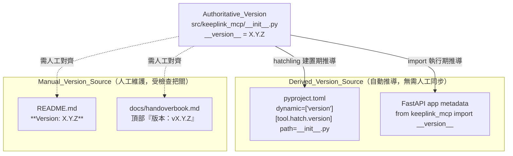
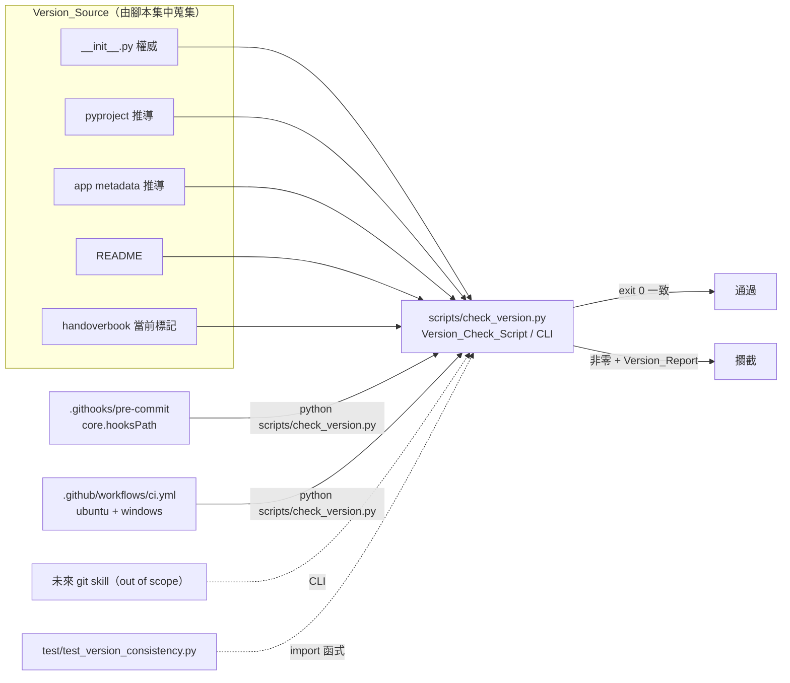

# Design Document

## Overview

本設計實作 `version-consistency-gate` 規格的兩大能力：

- **能力 A — 消滅同步點（單一真實來源）**：把手動維護的版本來源由 4 個降為 2 個。做法是讓 `pyproject.toml` 改用 hatchling 動態版本、`FastAPI_Service` 的 app metadata 改為 `import __version__`，使這兩者成為 **Derived_Version_Source**（建置/執行期由 `src/keeplink_mcp/__init__.py` 的 `__version__` 推導），僅 `README.md` 與 `docs/handoverbook.md` 仍為 **Manual_Version_Source**。
- **能力 B — 提早攔截（commit 當下 + CI 雙層）**：新增單一檢查腳本 `scripts/check_version.py`（Version_Check_Script），封裝所有擷取與比對邏輯，作為 pre-commit hook、CI 與未來 git skill 共用的 single source of truth；hook 於 commit 當下攔截、CI 於 push/PR 再把關。既有 `test/test_version_consistency.py` 重構為 **import 並呼叫該腳本函式**，消除重複邏輯（DRY）。

設計遵守專案硬規則：單檔 ≤ 500 行、單函式 ≤ 50 行、interface first、SoC/DRY、fail-fast（不加遮蓋錯誤的 fallback）、跨平台（Windows 11 + Linux）、不新增需連外網的執行前提。

### 三個待決點的定案（含取捨說明）

#### 待決點 1 — pre-commit hook 安裝方式：定案採 (a) `core.hooksPath`

比較三方案（依據 Requirement 6.6「不依賴需連外網下載的第三方框架」與 6.4「跨平台」）：

| 方案 | 受版控 | 一行啟用 | 外部依賴 | 跨平台 | 評估 |
| --- | --- | --- | --- | --- | --- |
| (a) `git config core.hooksPath .githooks` | 是（`.githooks/` 進版控） | 是 | 零 | 是（純 git 設定 + `python` 呼叫） | **採用** |
| (b) 安裝腳本複製到 `.git/hooks/` | hook 原始碼進版控，但需執行安裝步驟同步 | 否（需跑腳本，且改 hook 後要重跑） | 零 | 是 | 落選：需自寫複製/同步邏輯，易與源檔 drift |
| (c) pre-commit 框架（`.pre-commit-config.yaml`） | 設定進版控 | 一行 `pre-commit install` | **需 `pip install pre-commit` 且首次 `pre-commit install` 會連外網抓 hook 環境** | 是 | 落選：違反 Req 6.6 的外部框架/連外網前提 |

**定案理由**：(a) `core.hooksPath` 讓 hook 腳本本身受版控（`.githooks/pre-commit`），貢獻者只需一行 `git config core.hooksPath .githooks` 即啟用，零外部依賴、零連外網、跨平台。相對 (b) 免除「複製到 `.git/hooks/` 的同步腳本」這一技術債（源檔與實際 hook 兩份、易 drift）；相對 (c) 不引入需連外網的第三方框架。啟用指令會寫入 `CONTRIBUTING.md`。

**跨平台呼叫方式**：`.githooks/pre-commit` 是 POSIX sh 腳本（git 於 Windows 隨附 Git Bash，於 Linux 為系統 sh，皆能執行 sh 腳本），內容僅一行有效邏輯：呼叫 `python scripts/check_version.py`（Python 負責所有跨平台細節，如路徑、編碼）。hook 不寫任何平台專屬邏輯，藉「薄 hook + 厚 Python」讓跨平台責任集中在 Python 腳本。若環境將 `python` 對應到 Python 2，改用 `python3` 的 fallback 由 hook 以 `command -v` 偵測後選擇（此為執行環境相容，非遮蓋業務錯誤）。

#### 待決點 2 — handoverbook 當前標記擷取策略：定案「只掃前 N 行 + 首個 `版本：v` 標記」

- 現況頂部形如 `> 最後更新：2026-08-21 | 版本：v1.2.0（含 archive_and_cite）`（實測位於第 3 行）。
- 歷史引用（Historical_Version_Reference）散落於檔案後段（實測 `v1.1.1` 於第 102/108/277/340/420 行、`1.1.0` 於第 433 行），皆在 Release Notes / ADR 段落。

**擷取規則（三層防誤判）**：
1. **只掃描檔首前 `HEADER_SCAN_LINES = 10` 行**（當前標記固定在文件頂部標頭區塊；歷史引用最早出現在第 100 行後，遠超掃描窗）。
2. 在該窗內以 regex `版本：v(\d+\.\d+\.\d+)` 尋找 **第一個** 命中（`re.search` 首個 match）。此 regex 綁定 `版本：v` 前綴 —— 歷史引用形如「v1.1.1 僅檢查…」「升級至 1.1.0」皆無此前綴，天然不中。
3. 命中的 group(1) 即 Handoverbook_Current_Marker 版本值。

**為何不誤中歷史記錄**：歷史引用（(a) 在掃描窗外、(b) 缺 `版本：v` 前綴）二者任一即排除，實際是兩者皆滿足，雙重保險。

**fail-fast（Req 5.4）**：若前 N 行內找不到 `版本：v<semver>`，`raise ValueError`（不 fallback 掃全檔、不回傳空值），由 CLI 轉為非零 exit code 並在 Version_Report 指出「handoverbook 當前版本標記缺失」。

#### 待決點 3 — 既有 test：定案「邏輯上移到 check_version.py，測試改為 import 呼叫」

- 既有 `test/test_version_consistency.py` 自帶一套擷取（`get_pyproject_version`/`get_init_version`/`get_app_version`/`get_readme_version`/`collect_version_sources`）與判定（`check_version_consistency`）邏輯，以及 Property 1 property test。
- Req 9.6 要求測試「以呼叫 Version_Check_Script 提供的檢查邏輯為受測對象，不重複實作」。

**定案（single source of truth，DRY）**：
1. 把所有擷取與判定邏輯遷移進 `scripts/check_version.py`（見下文模組結構）；`get_*_version` 對應到腳本的 `extract_*` 函式，`check_version_consistency` 對應到腳本的 `check_consistency`。
2. 既有測試改為 `from scripts.check_version import ...`（或經 `conftest.py` 註冊 `scripts` 為可 import 路徑），刪除測試內重複的擷取/判定實作。
3. **遷移對應表**：
   - `get_pyproject_version` → **移除**（能力 A 後 pyproject 為 Derived_Version_Source，改由 `extract_pyproject_version` 走 hatchling 推導驗證，見能力 A）。
   - `get_app_version` → **移除**（app.py 不再寫死版本；改驗證 `import __version__` 的推導結果）。
   - `get_init_version`/`get_readme_version` → 併入腳本的 `extract_init_version`/`extract_readme_version`。
   - 新增 `extract_handoverbook_version`（既有測試尚未涵蓋，補上）。
   - `check_version_consistency` → 腳本的 `check_consistency`；既有 Property 1 test 改為 import 腳本函式，保留 ≥100 迭代設定。
4. 既有 `_TARGET_VERSION = "1.2.0"` 的 example/golden 測試保留（drift 大聲失敗），但其 handoverbook 檢查改用腳本的 `extract_handoverbook_version`。

## Architecture

### 版本流向（能力 A 完成後）



### 檢查與攔截流向（能力 B）



### 分層與職責（SoC）

Version_Check_Script 內部分三層，職責單一、互不越界：

1. **擷取層（extraction）**：每個 Version_Source 一個純函式，輸入檔案內容 / 環境、輸出版本字串或 `raise`（fail-fast）。不做比對。
2. **判定層（checking）**：輸入 `{來源: 版本}`，輸出比對結果（是否一致、格式是否合法、不一致清單）。純函式，無 I/O。
3. **CLI/報告層（cli）**：協調擷取 → 判定 → 產生 Version_Report → 設定 exit code、處理輸出編碼。唯一與 stdout/stderr、`sys.exit` 互動的層。

擷取層的 true fail-fast（Req 4.6）：CLI 依固定順序逐一呼叫擷取函式，**第一個** 擷取失敗即停止、不續掃、不累積清單。

## Components and Interfaces

> **Interface First**：以下先定義資料結構與函式簽章（型別註記），實作於 tasks 階段完成。

### 能力 A 變更（Derived_Version_Source 化）

**`pyproject.toml`**（Req 2）：
```toml
[project]
# 移除 version = "1.2.0"
dynamic = ["version"]
# ... 其餘不變 ...

[tool.hatch.version]
path = "src/keeplink_mcp/__init__.py"
```
建置/查詢期 hatchling 由 `__init__.py` 的 `__version__` 推導專案版本。build backend 已是 hatchling、wheel 打包設定（`[tool.hatch.build.targets.wheel]`）保留不動（Req 2.4）。

**`src/keeplink_mcp/api/app.py`**（Req 3）：
```python
from keeplink_mcp import __version__
# ...
app = FastAPI(title="KeepLink MCP", version=__version__)  # 不再寫死 "1.2.0"
```

**能力 A 對檢查層的影響**：pyproject 與 app metadata 成為 Derived_Version_Source 後，**不再作為「手動來源」進行字串比對**（它們的值定義上等於權威值）。檢查層改為 **驗證推導結果 == 權威值**：
- `extract_pyproject_version()`：以 hatchling 的版本 API（`hatchling.metadata` / `importlib.metadata.version("keeplink-mcp")` 於已安裝環境）取得推導版本，斷言 == `__version__`。若推導失敗則 fail-fast。
- `extract_app_version()`：`import` app factory 建立實例後讀 `app.version`（或直接驗證 `app.py` 引用 `__version__` 而非字面量），斷言 == `__version__`。

### 能力 B：`scripts/check_version.py` 模組結構

檔案佈局（單檔 ≤ 500 行；若逼近上限，擷取層可再拆至 `scripts/version_sources.py`，介面不變）：

```
scripts/check_version.py
├── 資料結構        VersionSource(dataclass), CheckResult(dataclass)
├── 常數            REPO_ROOT, SEMVER_PATTERN, HEADER_SCAN_LINES, SOURCE_SPECS
├── 擷取層 extract  extract_init_version / extract_pyproject_version /
│                   extract_app_version / extract_readme_version /
│                   extract_handoverbook_version
├── 蒐集層 collect  collect_sources() -> list[VersionSource]（true fail-fast）
├── 判定層 check    is_semver / check_consistency(...) -> CheckResult
├── 報告層 report   render_report(CheckResult) -> str
└── CLI            run_check() -> int ; main() -> None（含編碼設定）
```

#### 資料結構（dataclass）

```python
from dataclasses import dataclass

@dataclass(frozen=True)
class VersionSource:
    """單一納管版本來源的擷取結果。"""
    name: str          # 顯示名，如 "__init__.py"、"docs/handoverbook.md"
    version: str       # 擷取出的版本字串
    is_derived: bool   # True=Derived_Version_Source（驗推導）; False=Manual

@dataclass(frozen=True)
class CheckResult:
    """一致性判定結果。fail-fast 場景下 sources 只含到失敗點為止。"""
    authoritative: str            # 權威版本（__version__）
    sources: list[VersionSource]  # 已成功擷取的來源
    ok: bool                      # 全部一致且皆合法 semver
    mismatches: dict[str, str]    # {來源: 版本}，僅列不等於 authoritative 者
    invalid_format: dict[str, str]# {來源: 版本}，違反 Semver_Format 者
    extraction_error: str | None  # 首個擷取失敗來源的說明（true fail-fast）
```

#### 擷取層函式簽章（純函式，fail-fast）

```python
def extract_init_version(repo_root: Path) -> str: ...
    # 讀 src/keeplink_mcp/__init__.py，regex __version__ = "X.Y.Z"；失敗 raise ValueError

def extract_pyproject_version(repo_root: Path) -> str: ...
    # 取 hatchling 推導版本；失敗 raise（Derived：其值應 == 權威）

def extract_app_version(repo_root: Path) -> str: ...
    # import app factory 讀 app.version（Derived）；失敗 raise

def extract_readme_version(repo_root: Path) -> str: ...
    # 讀 README.md，regex Version:\s*(\d+\.\d+\.\d+)；失敗 raise ValueError

def extract_handoverbook_version(repo_root: Path) -> str: ...
    # 只掃前 HEADER_SCAN_LINES 行，regex 版本：v(\d+\.\d+\.\d+) 首個命中；
    # 找不到 raise ValueError（Req 5.4 fail-fast）
```

#### 蒐集層（集中來源清單 + true fail-fast，Req 4.6 / 8.5）

```python
# 集中維護的來源清單（no-args 預設檢查依此，Req 8.5）
SOURCE_SPECS: list[tuple[str, bool, Callable[[Path], str]]] = [
    ("src/keeplink_mcp/__init__.py", False, extract_init_version),  # 權威
    ("pyproject.toml",               True,  extract_pyproject_version),
    ("FastAPI app metadata",         True,  extract_app_version),
    ("README.md",                    False, extract_readme_version),
    ("docs/handoverbook.md",         False, extract_handoverbook_version),
]

def collect_sources(repo_root: Path) -> tuple[list[VersionSource], str | None]:
    """依 SOURCE_SPECS 順序逐一擷取；第一個擷取例外即停止（true fail-fast），
    回傳 (已成功來源, 首個錯誤說明 or None)。不累積成清單。"""
```

#### 判定層（純函式，無 I/O）

```python
SEMVER_PATTERN = re.compile(r"^\d+\.\d+\.\d+$")

def is_semver(version: str) -> bool: ...

def check_consistency(
    authoritative: str, sources: list[VersionSource]
) -> CheckResult:
    """比對每個來源版本是否 == authoritative 且皆為合法 semver。
    產生 mismatches / invalid_format；純資料轉換，可被 property test 直接餵資料。"""
```

#### CLI / 報告層（Req 8 對外契約）

```python
def render_report(result: CheckResult) -> str:
    """產生 Version_Report：不一致時含每個受檢來源的 {來源: 版本} 列表、
    格式違規來源、或首個擷取失敗來源。一致時回簡短 OK 訊息。"""

def run_check(repo_root: Path | None = None) -> int:
    """協調 collect -> check -> render；回傳 exit code（0 一致 / 非零 其餘）。"""

def main() -> None:
    """CLI 進入點：設定輸出編碼（見下）、no-args 走預設檢查、
    輸出 Version_Report、sys.exit(run_check())。"""

if __name__ == "__main__":
    main()
```

**CLI 契約細節（Req 8）**：
- **no-args 預設**（8.1、8.5）：不吃任何參數即以 `SOURCE_SPECS` 完成預設檢查；有無多餘參數不影響。
- **exit code**（8.2）：`0`=一致；非零=不一致 / 格式違規 / 擷取失敗。
- **emission**（8.3）：不一致或失敗時把 Version_Report 寫到 stderr（正常一致時可簡短寫 stdout）。
- **capturability + 編碼**（8.4）：Version_Report 含中文與可能的 emoji。Windows console 預設非 UTF-8（cp950/cp1252）會導致 `UnicodeEncodeError` 而遺失內容。對策：`main()` 開頭 `sys.stdout.reconfigure(encoding="utf-8")` 與 `sys.stderr.reconfigure(encoding="utf-8")`（Python ≥3.7），並在寫出後 `flush()`，確保跨平台可靠擷取、不因緩衝遺失。報告內容以純文字為主、emoji 僅作點綴且在 UTF-8 下安全。

### hook 與 CI 介面

**`.githooks/pre-commit`**（Req 6，受版控、跨平台薄殼）：
```sh
#!/bin/sh
# 選擇可用的 python 直譯器（跨平台相容，非業務 fallback）
if command -v python >/dev/null 2>&1; then PY=python; else PY=python3; fi
"$PY" scripts/check_version.py || {
  echo "版本一致性檢查未通過，已阻擋本次 commit。" >&2
  exit 1
}
```
啟用（寫入 `CONTRIBUTING.md`）：`git config core.hooksPath .githooks`。

**`.github/workflows/ci.yml`**（Req 7）：在既有 `test` job 內、`Install dependencies` 之後新增一步，**不動** 既有 Lint / Test / Security audit：
```yaml
      - name: Version consistency check
        run: python scripts/check_version.py
```
既有 matrix 已含 `ubuntu-latest` + `windows-latest`（Req 7.4），此步於兩平台皆跑。

## Data Models

本功能無持久化資料模型；核心資料為記憶體內的兩個 dataclass（見上）：

- **VersionSource**：`{name, version, is_derived}` —— 一筆納管來源的擷取結果。
- **CheckResult**：`{authoritative, sources, ok, mismatches, invalid_format, extraction_error}` —— 判定層的完整輸出，同時是 `render_report` 與測試斷言的資料契約。

版本字串值物件受 **Semver_Format** 約束：`^\d+\.\d+\.\d+$`。

## Correctness Properties

*A property is a characteristic or behavior that should hold true across all valid executions of a system—essentially, a formal statement about what the system should do. Properties serve as the bridge between human-readable specifications and machine-verifiable correctness guarantees.*

本功能的核心邏輯（版本擷取與一致性判定）為純函式、輸入空間大，適合 property-based testing。以下屬性經反思去除冗餘後保留：判定邏輯合併為單一綜合屬性（Property 1），格式合法性（Property 2）、true fail-fast 停止點（Property 3）、handoverbook 防誤判（Property 4）、報告編碼 round-trip（Property 5）各自獨立。設定檔結構檢查、CLI 存在性、CI/hook 的 git 行為屬 EXAMPLE/SMOKE/INTEGRATION，見 Testing Strategy，不列為屬性。

### Property 1: 一致性判定與不一致報告

*For any* 權威版本字串與一組納管來源版本：當每個來源版本皆等於權威版本且皆為合法 semver 時，`check_consistency` 的結果 `ok` 應為 `True`；只要有任一來源版本不等於權威版本，`ok` 應為 `False`，且對該結果產生的 Version_Report 應列出每個受檢來源與其版本值（`{來源: 版本}`）。

**Validates: Requirements 4.2, 4.3, 4.4, 9.3, 9.4**

### Property 2: Semver 格式違規偵測

*For any* 一組納管來源版本，只要有任一來源的版本字串不符合 Semver_Format（`^\d+\.\d+\.\d+$`），`check_consistency` 的結果 `ok` 應為 `False`，且 `invalid_format` 應包含該來源與其版本值。

**Validates: Requirements 1.2, 4.5**

### Property 3: True fail-fast 於首個擷取失敗即停止

*For any* 來源清單與任一「首個會擷取失敗的位置 k」：`collect_sources` 應在索引 k 停止，回傳的已成功來源恰為索引 0..k-1（數量等於 k），錯誤說明只提及索引 k 的那一個來源，且索引 k 之後的來源擷取函式從未被呼叫（不續掃、不將失敗累積成清單）。

**Validates: Requirements 4.6**

### Property 4: Handoverbook 只擷取當前標記、不受歷史引用污染

*For any* handoverbook 內容，其頂部標頭區塊含當前標記 `版本：v<X.Y.Z>`，其後段附加任意數量、任意值的 Historical_Version_Reference（如 `v1.1.1`、`升級至 1.1.0`）：`extract_handoverbook_version` 回傳的版本字串應恆等於頂部當前標記的版本值，與歷史引用的數量與內容無關。

**Validates: Requirements 5.1, 5.3, 9.5**

### Property 5: Version_Report 編碼 round-trip

*For any* 由 ASCII、中文與 emoji 字元組成的 Version_Report 內容，經 UTF-8 輸出串流寫出後再以 UTF-8 讀回，解碼所得字串應與原始內容相等（不因編碼或緩衝而遺失或損壞內容）。

**Validates: Requirements 8.4**

## Error Handling

採 fail-fast，不加遮蓋錯誤的 fallback：

- **擷取失敗（檔案不存在 / 無法解析 / 找不到版本字串）**：對應擷取函式 `raise ValueError`（訊息指明來源與原因）。`collect_sources` 捕捉 **第一個** 例外即停止（Req 4.6 true fail-fast），將該來源說明放入 `CheckResult.extraction_error`，`run_check` 回非零 exit code、`render_report` 只列該來源。
- **handoverbook 缺當前標記（Req 5.4）**：`extract_handoverbook_version` 在前 `HEADER_SCAN_LINES` 行內找不到 `版本：v<semver>` 即 `raise ValueError`，不 fallback 掃全檔、不回空字串。
- **版本不一致（Req 4.4）**：非例外流程；`check_consistency` 回 `ok=False` 並填 `mismatches`，由 `run_check` 轉非零 exit code。
- **格式違規（Req 4.5）**：`check_consistency` 填 `invalid_format`、`ok=False`。
- **Derived 推導失敗（能力 A）**：`extract_pyproject_version` / `extract_app_version` 推導不出版本時 `raise`，走與擷取失敗相同的 fail-fast 路徑。
- **輸出編碼（Req 8.4）**：`main()` 先 `reconfigure(encoding="utf-8")` 再輸出並 `flush()`，避免 Windows console 非 UTF-8 造成 `UnicodeEncodeError`。
- **exit code 一致性（Req 8.2）**：所有非通過情境（不一致 / 格式違規 / 擷取失敗）皆回非零；僅全通過回 `0`。

## Testing Strategy

測試置於 `test/`（Req 9.1），採「單元 + property」雙軌；既有 `test/test_version_consistency.py` 依待決點 3 重構為 **import `scripts/check_version.py` 的函式**（Req 9.6，不重複實作）。

### Property-Based Tests（hypothesis，每項 ≥100 迭代）

選用 `hypothesis`（專案 dev deps 已含）；不自行實作 PBT 框架。每個 property test 以註解標記對應設計屬性，格式：`Feature: version-consistency-gate, Property {n}: {property_text}`。

| 對應屬性 | 生成策略 | 受測對象 |
| --- | --- | --- |
| Property 1 | 生成 semver 值套用到所有來源（一致集）＋隨機挑一來源改為不同 semver（不一致集） | `check_consistency` + `render_report` |
| Property 2 | 生成含非 semver 字串（`st.text()` 過濾掉合法 semver）注入某來源 | `check_consistency` |
| Property 3 | 生成失敗索引 `k`，令第 k 個擷取函式拋錯並記錄後續是否被呼叫（用 spy/mock 計數） | `collect_sources` |
| Property 4 | 生成頂部當前標記 semver ＋ 檔尾附加隨機數量的歷史 `v<semver>` 片段 | `extract_handoverbook_version` |
| Property 5 | 生成 ASCII + 中文（CJK 範圍）+ emoji 混合字串 | UTF-8 輸出串流 round-trip |

- Property 1 同時涵蓋 Req 9.3（≥100 迭代驗證通過/失敗性質）與 9.4（報告含每來源與值）。
- 既有 `TestVersionConsistencyProperty`（Property 1 對真實來源每例重讀）保留精神，但改 import 腳本的 `check_consistency`，並補上對 Derived 來源（能力 A 後）的處理。

### Unit / Example Tests

- **能力 A 結構檢查（Req 2.1–2.4, 3.1–3.3）**：example 斷言 `pyproject.toml` 含 `dynamic=["version"]`、無靜態 `version` 行、`[tool.hatch.version].path` 正確、wheel 設定保留；斷言 `app.py` `import __version__` 且無版本字面量；斷言 `extract_pyproject_version()==extract_app_version()==__version__`（推導=權威）。
- **來源清單組成（Req 1.1–1.3）**：example 斷言權威來源為 `__init__.py`、Manual 來源數為 2、其餘為 Derived。
- **handoverbook 形式與缺標記（Req 5.2, 5.4）**：example 對真實檔斷言擷取到當前版本；edge case 生成「缺標記」「標記在掃描窗外」內容斷言 `raise ValueError`。
- **CLI 契約（Req 8.1–8.3, 8.5）**：example 以子行程呼叫 `python scripts/check_version.py` 斷言 no-args 可跑、exit code 對一致/不一致正確、不一致時輸出非空且含來源清單。
- **既有真實來源一致性（Req 9.2）**：example 斷言 `collect_sources` 所得全部 == `__version__`。

### Smoke / Integration（NOT PBT — 見理由）

以下屬基礎設施 / 檔案內容 / git 平台行為，行為不隨輸入變化或屬外部服務，故用 smoke（單次）或 integration（1–3 例），**不** 用 PBT：

- **Smoke**：`scripts/check_version.py` 存在且可 import（4.1）；`.githooks/pre-commit` 存在且呼叫腳本（6.1, 6.5, 6.6）；`ci.yml` 含版本檢查步驟（7.1）、matrix 含 ubuntu+windows（7.4）、保留 lint/test/audit（7.5）；`CONTRIBUTING.md` 含 `core.hooksPath` 啟用說明（6.6）。
- **Integration（可選、CI 天然涵蓋）**：hook 於一致/不一致 commit 的攔截行為（6.2, 6.3）；CI 於兩平台實際執行腳本（4.7, 6.4, 7.2, 7.3）—— 這些由 CI matrix 兩平台各跑一次腳本天然驗證，無需在單元層重複。

### Lint 與測試執行（tasks 收尾）

依專案硬規則，`tasks.md` 收尾任務須包含執行 `ruff check src/ test/ scripts/` 與 `pytest test/ -v`，並確認 `python scripts/check_version.py` 於本機回 exit 0。

---

**下一步**：本階段（Design）已完成。請於 UI 檢視 design.md，確認後再進入 tasks 階段。若發現需求有缺口，我可回到 requirements 釐清。
