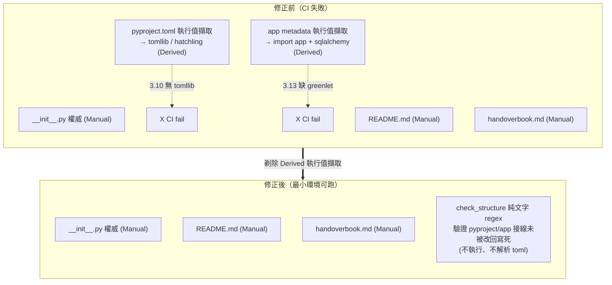
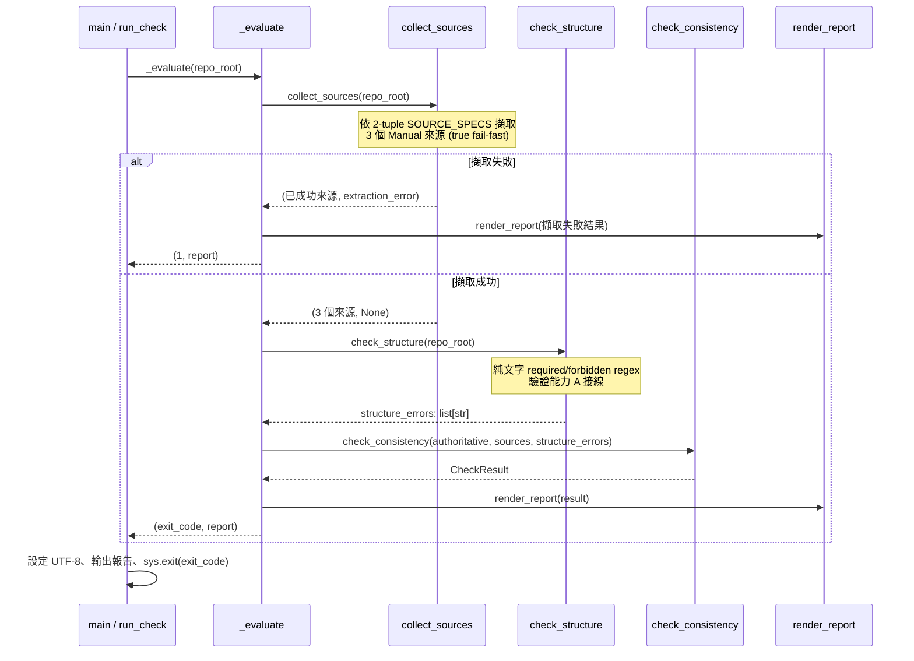

# Design Document：version-gate-minimal-env-fix

## Overview

本 spec 是對既有已完成 spec `version-consistency-gate`（位於 `.kiro/specs/version-consistency-gate/`，30/30 完結）的**設計修正**，不是新功能。既有能力 B 的核心腳本 `scripts/check_version.py` 在 GitHub Actions CI 上四個 job 全數失敗（`ubuntu-latest` + `windows-latest` × Python 3.10/3.13），本修正的唯一目標是讓該閘門回到「薄殼、最小環境可跑、跨平台全綠」的設計定位。

**CI 失敗根因（已確認，非版本漂移）**：

| job 環境 | 失敗點 | 根因 |
| --- | --- | --- |
| Python 3.10（ubuntu/windows） | `extract_pyproject_version` 的 fallback 路徑 `import tomllib` | `tomllib` 為 Python 3.11+ 才進標準庫，3.10 無此模組 |
| Python 3.13（乾淨環境） | `extract_app_version` → `import keeplink_mcp.api.app` → 連帶 import SQLAlchemy asyncio | SQLAlchemy asyncio 需要 `greenlet`，CI 的 `pip install -e ".[dev]"` 未安裝它 |

兩者的共同病灶：腳本去「擷取 Derived 來源（`pyproject.toml`、FastAPI app metadata）的**執行值**」，為此被迫引入 `tomllib` 與 import 整個 app，違反閘門「只用標準庫、最小環境可跑」的定位。

**修正方向（奧卡姆剃刀）**：剃除兩個 Derived_Version_Source 的執行值擷取。能力 A 已讓 `pyproject.toml` 與 app metadata 由權威 `__version__` 結構性推導，正常情況不可能漂移；為它們付出「引入 tomllib + import 整個 app」的代價不划算。改以**純文字結構檢查**（required/forbidden regex）在 commit 當下驗證「能力 A 的接線沒有被改回寫死」，把這道防線留在 pre-commit 階段而非退到 CI 的 pytest。

本修正遵守專案硬規則：單檔 ≤ 500 行、單函式 ≤ 50 行、interface first、SoC/DRY、fail-fast（不加遮蓋錯誤的 fallback）、跨平台（Windows 11 + Linux）、不新增需連外網或非標準庫的執行前提。

### 已定案的核心設計決策（本 spec 直接採用，不重新辯論）

1. **剃除 Derived 執行值擷取**：移除 `extract_pyproject_version`、`extract_app_version`、`_derive_pyproject_version_from_config`。
2. **閘門執行環境定位 = 最小/乾淨環境**：腳本只能用 Python 標準庫（`re` + `pathlib`），**不得** import 專案 runtime 程式碼、**不得** 用 `tomllib`、**不得** import `app`/`sqlalchemy`/`hatchling`。
3. **納管來源縮為 3 個，全為 Manual**：`src/keeplink_mcp/__init__.py`（權威）、`README.md`、`docs/handoverbook.md`。`VersionSource` 移除 `is_derived` 欄位；`SOURCE_SPECS` 由 3-tuple `(name, is_derived, extractor)` 改為 2-tuple `(name, extractor)`。
4. **補法甲 — 新增純文字結構檢查層 `check_structure`**：以 required/forbidden regex（純文字，不執行 app、不解析 toml）驗證能力 A 接線未被改回寫死——`pyproject.toml` 含 `dynamic = ["version"]` 且無行首靜態 `version`；`app.py` 含 `version=__version__` 且無字面量。目的是把「接線被改壞」這道防線留在 pre-commit commit 當下，避免保障缺口 G2（退到 CI pytest 才抓）。
5. **能力 A 接線正確性的雙重保障**：commit 階段由 `check_structure` 顧（新增），pytest 階段由既有 `test_capability_a_structure.py` 結構測試顧。
6. **對外契約不變**：CLI exit code 語義、Version_Report 報告格式、fail-fast 語義、Windows UTF-8 處理全部保持不變。
7. **DRY 微調**：新增 `_read_source` 共用讀檔 helper；三個 extractor 各自 `read + regex`（不引入過度抽象的共用 extractor）。

### 驗收標準（使用者明確要求）

本機測試不算數。必須 push 後 **GitHub Actions CI 在 `ubuntu-latest` + `windows-latest` × Python 3.10 + 3.13 四個 job 全綠**才算完成。

---

## 與既有 spec 的關係

- 本 spec **不更動** `version-consistency-gate` 的 requirements 編號；requirements 的語義（Req 1.3「其餘納管來源皆為 Derived_Version_Source」）本次由「3-tuple + 執行值擷取」的實作詮釋，改為「以結構檢查驗證 Derived 接線 + 來源清單只含 Manual 比對」的實作詮釋——這是實作層面的設計修正，不改變需求意圖（能力 A 仍讓 pyproject/app 由權威推導）。
- 既有 `version-consistency-gate/design.md` 將新增一段「設計修正紀錄」，說明本次剃除與改法，供追溯。
- 既有 `version-consistency-gate/tasks.md` 被先前對話誤加的「任務 15」整段將被移除，使該舊 spec 回到乾淨的 30/30 完結狀態。

---

## Architecture

### 修正前 vs 修正後的來源與擷取（能力 B）



### 修正後的檢查流向（CLI 單次執行）



### 分層與職責（SoC，互不越界）

Version_Check_Script 內部維持原分層，僅調整內容：

1. **擷取層 extraction**：3 個純函式（`extract_init_version` / `extract_readme_version` / `extract_handoverbook_version`），各自 `read + regex`，共用 `_read_source` 讀檔 helper。輸出版本字串或 `raise ValueError`（fail-fast）。**不含任何 Derived 執行值擷取。**
2. **結構檢查層 structure（新增）**：`check_structure(repo_root)` 以 `STRUCTURE_SPECS`（required/forbidden regex）純文字驗證能力 A 接線，回傳違規說明清單（空清單代表通過）。不執行 app、不解析 toml。
3. **蒐集層 collect**：依 2-tuple `SOURCE_SPECS` 順序逐一擷取，first-failure 即停止（true fail-fast）。
4. **判定層 checking**：純函式，比對來源 == 權威 + semver 合法 + **併入結構檢查違規**，輸出 `CheckResult`。無 I/O。
5. **報告層 report**：渲染 Version_Report 文字（格式與修正前相容，新增結構違規分節）。
6. **CLI 層 cli**：`_evaluate` 協調、`run_check` 回 exit code、`main` 設編碼並輸出。唯一與 stdout/stderr、`sys.exit` 互動處。

---

## Components and Interfaces

> **Interface First**：先定義資料結構與函式簽章，實作於 tasks 階段完成。

### 資料結構（dataclass）

```python
from __future__ import annotations

import re
from collections.abc import Callable
from dataclasses import dataclass
from pathlib import Path


@dataclass(frozen=True)
class VersionSource:
    """單一納管版本來源的擷取結果（修正後移除 is_derived）。

    修正後所有納管來源皆為 Manual_Version_Source，不再需要 is_derived 區分。
    """
    name: str       # 顯示名，如 "src/keeplink_mcp/__init__.py"
    version: str    # 擷取出的版本字串


@dataclass(frozen=True)
class StructureCheck:
    """能力 A 接線的單項純文字結構規則。

    以 required/forbidden regex 驗證指定檔案內容，不執行程式、不解析 toml。
    """
    name: str                          # 顯示名，如 "pyproject.toml dynamic version"
    file_path: str                     # 相對 repo_root 的 posix 路徑
    required: list[re.Pattern[str]]    # 必須全部命中（缺一即違規）
    forbidden: list[re.Pattern[str]]   # 必須全部不命中（命中任一即違規）


@dataclass(frozen=True)
class CheckResult:
    """一致性判定結果（新增 structure_errors）。

    Attributes:
        authoritative: 權威版本（__version__）。
        sources: 已成功擷取的來源清單（修正後為 3 個 Manual）。
        ok: 全部來源 == 權威、皆合法 semver，且結構檢查無違規時為 True。
        mismatches: {來源: 版本}，僅列不等於 authoritative 者。
        invalid_format: {來源: 版本}，僅列違反 Semver_Format 者。
        structure_errors: 能力 A 結構檢查的違規說明清單（空代表通過）。
        extraction_error: 首個擷取失敗來源的說明（true fail-fast）；無則 None。
    """
    authoritative: str
    sources: list[VersionSource]
    ok: bool
    mismatches: dict[str, str]
    invalid_format: dict[str, str]
    structure_errors: list[str]
    extraction_error: str | None
```

### 常數

```python
REPO_ROOT: Path = Path(__file__).resolve().parent.parent
SEMVER_PATTERN: re.Pattern[str] = re.compile(r"^\d+\.\d+\.\d+$")
HEADER_SCAN_LINES: int = 10  # handoverbook 當前標記只掃前 N 行，避開歷史引用
```

### 擷取層（純函式、fail-fast、僅標準庫）

```python
def _read_source(path: Path) -> str:
    """共用讀檔 helper：明確 encoding="utf-8" 讀檔，失敗 raise ValueError。

    DRY：三個 extractor 共用此讀檔邏輯，各自負責自己的 regex 擷取。
    跨平台：以 pathlib 傳入的 path 讀取，encoding 明確指定確保行為一致。
    """

def extract_init_version(repo_root: Path) -> str:
    """讀 src/keeplink_mcp/__init__.py，regex __version__ = "X.Y.Z"（權威）。"""

def extract_readme_version(repo_root: Path) -> str:
    """讀 README.md，regex Version:\\s*(\\d+\\.\\d+\\.\\d+)（Manual）。"""

def extract_handoverbook_version(repo_root: Path) -> str:
    """只掃 docs/handoverbook.md 前 HEADER_SCAN_LINES 行，regex 版本：v(X.Y.Z)
    首個命中；找不到 raise ValueError（Req 5.4 fail-fast）。"""
```

> **已移除**：`extract_pyproject_version`、`extract_app_version`、`_derive_pyproject_version_from_config`（連同 `import tomllib`、`import hatchling`、`import sqlalchemy`、`import keeplink_mcp.api.app`）。

### 結構檢查層（新增，純文字 regex，Req 2.1/2.2/3.1/3.2 的 commit 當下防線）

```python
# 集中維護的結構規則清單，驗證能力 A 接線未被改回寫死。
STRUCTURE_SPECS: list[StructureCheck] = [
    StructureCheck(
        name="pyproject.toml 動態版本接線",
        file_path="pyproject.toml",
        required=[re.compile(r'dynamic\s*=\s*\[\s*"version"\s*\]')],
        # 禁止行首靜態 version = "..."（不誤傷 requires-python / target-version）
        forbidden=[re.compile(r'^version\s*=\s*"[^"]+"', re.MULTILINE)],
    ),
    StructureCheck(
        name="app.py 引用權威版本接線",
        file_path="src/keeplink_mcp/api/app.py",
        required=[re.compile(r"version\s*=\s*__version__")],
        # 禁止 FastAPI(... version="字面量" ...)
        forbidden=[re.compile(r'version\s*=\s*"[^"]+"')],
    ),
]


def check_structure(repo_root: Path) -> list[str]:
    """純文字驗證能力 A 接線（不執行 app、不解析 toml、僅標準庫 re）。

    對每個 StructureCheck：讀取檔案內容，確認所有 required 命中、
    所有 forbidden 不命中；任一違規收集一條說明。

    Returns:
        違規說明清單；空清單代表全部接線正確。

    Note:
        檔案讀取失敗（檔案不存在）亦視為違規並收集說明（fail-fast：
        能力 A 的目標檔應存在，缺檔代表接線被破壞）。
    """
```

### 蒐集層（2-tuple SOURCE_SPECS + true fail-fast）

```python
# 修正後：2-tuple (顯示名, 擷取函式)，全為 Manual，順序即 fail-fast 檢查順序。
SOURCE_SPECS: list[tuple[str, Callable[[Path], str]]] = [
    ("src/keeplink_mcp/__init__.py", extract_init_version),  # 權威，置首
    ("README.md", extract_readme_version),                   # Manual
    ("docs/handoverbook.md", extract_handoverbook_version),  # Manual
]


def collect_sources(repo_root: Path) -> tuple[list[VersionSource], str | None]:
    """依 SOURCE_SPECS 順序逐一擷取；第一個擷取例外即停止（true fail-fast），
    回傳 (已成功來源, 首個錯誤說明 or None)。不續掃、不累積失敗清單。"""
```

### 判定層（純函式、無 I/O、併入結構檢查）

```python
def is_semver(version: str) -> bool:
    """以 SEMVER_PATTERN 判定是否符合 Semver_Format。"""

def check_consistency(
    authoritative: str,
    sources: list[VersionSource],
    structure_errors: list[str],
) -> CheckResult:
    """比對每個來源 == authoritative 且皆合法 semver，併入 structure_errors。

    ok 僅在 無 mismatch、無 invalid_format、且 structure_errors 為空 時為 True。
    純資料轉換，可被 property test 直接餵資料。
    """
```

### 報告層（Version_Report，格式相容 + 新增結構違規分節）

```python
def render_report(result: CheckResult) -> str:
    """渲染 Version_Report。分派優先序與修正前相同：
    擷取失敗（fail-fast）> 一致 > 不一致/格式違規/結構違規。
    不一致情境新增「能力 A 接線結構違規」分節（有違規時才附上）。
    """
```

### CLI 層（對外契約不變）

```python
def _evaluate(repo_root: Path) -> tuple[int, str]:
    """協調 collect -> check_structure -> check_consistency -> render。
    回傳 (exit code, Version_Report 文字)。擷取失敗時走 fail-fast 單一來源報告。"""

def run_check(repo_root: Path | None = None) -> int:
    """回傳 exit code（0 一致 / 非零 其餘）。"""

def main() -> None:
    """CLI 進入點：開頭 reconfigure stdout/stderr 為 UTF-8；no-args 走
    SOURCE_SPECS 預設檢查；不一致/失敗寫 stderr 並 flush，一致寫 stdout；
    sys.exit(exit_code)。"""
```

**CLI 契約細節（修正前後不變）**：
- no-args 預設（Req 8.1/8.5）：以 `SOURCE_SPECS` 完成預設檢查。
- exit code（Req 8.2）：`0`=一致；非零=不一致 / 格式違規 / 結構違規 / 擷取失敗。
- emission（Req 8.3）：不一致或失敗把 Version_Report 寫 stderr。
- capturability + 編碼（Req 8.4）：`main()` 開頭 `reconfigure(encoding="utf-8")` + 寫出後 `flush()`，避開 Windows console 非 UTF-8 的 `UnicodeEncodeError`。

---

## Data Models

無持久化資料模型。核心為記憶體內三個 frozen dataclass：

- **VersionSource**：`{name, version}` —— 一筆 Manual 來源的擷取結果（移除 `is_derived`）。
- **StructureCheck**：`{name, file_path, required, forbidden}` —— 一條能力 A 接線的純文字結構規則。
- **CheckResult**：`{authoritative, sources, ok, mismatches, invalid_format, structure_errors, extraction_error}` —— 判定層完整輸出，同時是 `render_report` 與測試斷言的資料契約。

版本字串受 **Semver_Format** 約束：`^\d+\.\d+\.\d+$`。

---

## Algorithmic Pseudocode

### `check_structure` 核心演算法（新增）

```pascal
ALGORITHM check_structure(repo_root)
INPUT: repo_root 為 repo 根目錄
OUTPUT: errors 為違規說明字串清單（空清單代表接線正確）

BEGIN
  errors <- empty list

  FOR each spec IN STRUCTURE_SPECS DO
    target <- repo_root JOIN spec.file_path  // 以 pathlib 跨平台組路徑

    // 讀檔失敗視為違規（能力 A 目標檔缺失 = 接線被破壞，fail-fast 不靜默）
    TRY
      content <- read_text(target, encoding="utf-8")
    CATCH OSError AS exc
      errors.append(spec.name + "：無法讀取 " + target + "（" + exc + "）")
      CONTINUE
    END TRY

    // required：全部必須命中
    FOR each pattern IN spec.required DO
      IF pattern.search(content) IS NULL THEN
        errors.append(spec.name + "：缺少必要接線 " + pattern.pattern)
      END IF
    END FOR

    // forbidden：全部必須不命中
    FOR each pattern IN spec.forbidden DO
      IF pattern.search(content) IS NOT NULL THEN
        errors.append(spec.name + "：出現禁止的寫死 " + pattern.pattern)
      END IF
    END FOR
  END FOR

  RETURN errors
END
```

**Preconditions**：`STRUCTURE_SPECS` 已定義；`repo_root` 為合法目錄。
**Postconditions**：回傳的 errors 僅含違規說明；接線完全正確時為空 list；不執行任何專案程式碼、不解析 toml。
**Loop Invariants**：已處理的 spec 其違規皆已收集進 errors；errors 只增不減。

### `_evaluate` 併入結構檢查（修改）

```pascal
ALGORITHM _evaluate(repo_root)
INPUT: repo_root
OUTPUT: (exit_code, report_text)

BEGIN
  (sources, extraction_error) <- collect_sources(repo_root)

  IF extraction_error IS NOT NULL THEN
    // true fail-fast：authoritative 取首筆成功來源或空字串
    authoritative <- sources[0].version IF sources NOT empty ELSE ""
    result <- CheckResult(authoritative, sources, ok=False,
                         mismatches={}, invalid_format={},
                         structure_errors=[], extraction_error=extraction_error)
    RETURN (1, render_report(result))
  END IF

  authoritative <- sources[0].version        // 權威來源恆為 SOURCE_SPECS 首筆
  structure_errors <- check_structure(repo_root)   // 新增：併入結構檢查
  result <- check_consistency(authoritative, sources, structure_errors)
  exit_code <- 0 IF result.ok ELSE 1
  RETURN (exit_code, render_report(result))
END
```

**Preconditions**：`SOURCE_SPECS` 首筆為權威來源。
**Postconditions**：exit_code 0 當且僅當來源一致、格式合法且結構檢查無違規；report 恆為可輸出字串。

---

## Example Usage

```python
# CLI 預設執行（hook / CI 呼叫）
# $ python scripts/check_version.py
# -> 一致：exit 0，stdout 印 "版本一致：所有來源皆為 X.Y.Z"
# -> 結構違規：exit 1，stderr 印含「能力 A 接線結構違規」分節的 Version_Report

# 程式內使用（測試 import）
from scripts.check_version import check_structure, check_consistency, VersionSource

# 結構檢查：接線正確時回空 list
errors = check_structure(repo_root)
assert errors == []

# 一致性判定（純函式，可直接餵資料）
sources = [
    VersionSource("src/keeplink_mcp/__init__.py", "1.2.0"),
    VersionSource("README.md", "1.2.0"),
    VersionSource("docs/handoverbook.md", "1.2.0"),
]
result = check_consistency("1.2.0", sources, structure_errors=[])
assert result.ok is True
```

---

## Correctness Properties

*A property is a characteristic or behavior that should hold true across all valid executions of a system—essentially, a formal statement about what the system should do. Properties serve as the bridge between human-readable specifications and machine-verifiable correctness guarantees.*

本修正的核心邏輯（一致性判定、結構檢查、報告渲染）為純函式、輸入空間大，適合 property-based testing。經 prework 分析與反思去冗餘後，與本修正相關的屬性如下：既有 `version-consistency-gate` 的 **Property 1** 須更新（判定納入 `structure_errors`）、**Property 3** 沿用（true fail-fast，實作僅因 2-tuple 調整 spy/mock、性質不變）；本修正新增 **Property 6**（結構檢查正確性）與 **Property 7**（結構違規報告分節）。既有 **Property 2 / 4 / 5** 不受本修正影響，沿用不變，不在此重列。靜態結構斷言（移除符號、import 白名單、SOURCE_SPECS 組成）、CLI 契約、pre-commit/CI 的 git 行為屬 EXAMPLE/SMOKE/INTEGRATION，見 Testing Strategy，不列為屬性。

> 屬性編號延續既有 `version-consistency-gate` 的 Property 1–5；本修正更新 Property 1、沿用 Property 3、新增 Property 6 與 Property 7。每個 property test 以註解標記 `Feature: version-gate-minimal-env-fix, Property {n}: {property_text}`。

### Property 1（更新）：一致性判定納入結構檢查

*For any* 權威版本字串、一組納管來源版本與一組 `structure_errors`：`check_consistency` 的結果 `ok` 應為 `True` **當且僅當**「每個來源版本皆等於權威版本」「所有來源版本皆為合法 semver」且「`structure_errors` 為空清單」三者同時成立；只要任一來源不等於權威版本、任一來源格式違規、或 `structure_errors` 非空，`ok` 應為 `False`，且對不一致結果產生的 Version_Report 應列出每個受檢來源與其版本值（`{來源: 版本}`）。

**Validates: Requirements 6.3, 6.4**

### Property 3（沿用，實作微調）：True fail-fast 於首個擷取失敗即停止

*For any* 2-tuple `SOURCE_SPECS` 與任一「首個會擷取失敗的位置 k」：`collect_sources` 應在索引 k 停止，回傳的已成功來源恰為索引 0..k-1（數量等於 k），錯誤說明只提及索引 k 的那一個來源，且索引 k 之後的擷取函式從未被呼叫（不續掃、不累積失敗清單）。本修正僅因來源規格由 3-tuple 改為 2-tuple 而調整測試 spy/mock，性質不變。

**Validates: Requirements 8.5**

### Property 6（新增）：結構檢查正確性

*For any* 針對 `STRUCTURE_SPECS` 各目標檔的內容組合（含「全部 required 命中且全部 forbidden 不命中」「至少一條 required 缺失」「至少一條 forbidden 命中」「至少一個目標檔缺失」等情境）：`check_structure(repo_root)` 回傳空清單 **當且僅當** 所有 StructureCheck 的 required regex 全部命中、所有 forbidden regex 全部不命中、且所有目標檔皆可讀取；只要存在任一違規（含目標檔缺失），回傳清單應為非空、應為每一條違規各收集一條對應說明、且不因任一違規提早中止對其餘 StructureCheck 的處理（所有違規皆被收集）。此性質同時保證「不誤判 `requires-python` / `target-version` 等非版本欄位為行首靜態 `version` 違規」。

**Validates: Requirements 2.1, 2.2, 2.4, 3.1, 3.2, 3.4, 4.2, 4.3**

### Property 7（新增）：結構違規報告分節

*For any* `CheckResult`：其產生的 Version_Report 包含「能力 A 接線結構違規」分節 **當且僅當** `structure_errors` 為非空清單；當 `structure_errors` 非空時，報告中應出現其每一條違規說明文字；當 `structure_errors` 為空時，報告不應附上該分節。

**Validates: Requirements 7.1, 7.2**

---

## Error Handling

採 fail-fast，不加遮蓋錯誤的 fallback：

- **擷取失敗（檔案不存在 / 找不到版本字串）**：對應 extractor `raise ValueError`（經 `_read_source` 或自身 regex 檢查）；`collect_sources` 捕捉**第一個**例外即停止（true fail-fast），放入 `CheckResult.extraction_error`，`run_check` 回非零，`render_report` 只列該來源。
- **handoverbook 缺當前標記（Req 5.4）**：`extract_handoverbook_version` 在前 `HEADER_SCAN_LINES` 行內找不到 `版本：v<semver>` 即 `raise ValueError`，不 fallback 掃全檔。
- **能力 A 接線被改壞（結構違規）**：`check_structure` 回非空 `structure_errors`，`check_consistency` 使 `ok=False`，`run_check` 回非零——這道防線在 commit 當下即生效（補法甲，避免保障缺口 G2）。
- **版本不一致（Req 4.4）/ 格式違規（Req 4.5）**：非例外流程；`check_consistency` 填 `mismatches` / `invalid_format` 並 `ok=False`。
- **輸出編碼（Req 8.4）**：`main()` 先 `reconfigure(encoding="utf-8")` 再輸出並 `flush()`。
- **最小環境保證**：腳本只 import `re`、`sys`、`pathlib`、`dataclasses`、`collections.abc`（皆標準庫），於 Python 3.10 乾淨環境可直接執行，無 `tomllib`/`hatchling`/`sqlalchemy`/專案 runtime 依賴。

---

## Testing Strategy

測試置於 `test/`，採「單元 + property」雙軌。受影響測試須移除對已刪符號（`extract_pyproject_version` / `extract_app_version` / `is_derived` / 3-tuple `SOURCE_SPECS`）的依賴，property 測試維持 ≥100 迭代、不得弱化斷言。

### 受影響測試檔與處理

| 測試檔 | 處理 |
| --- | --- |
| `test_version_consistency.py` | 移除對 `extract_pyproject_version`/`extract_app_version` 的引用；一致性斷言改用 3 個 Manual 來源 |
| `test_source_list_composition.py` | 改驗 `SOURCE_SPECS` 為 3 項 2-tuple、權威置首；移除 Derived/`is_derived` 斷言 |
| `test_property1_consistency.py` | `check_consistency` 新增 `structure_errors` 參數；生成資料時傳 `[]`；維持 ≥100 迭代 |
| `test_property3_fail_fast.py` | 依 2-tuple `SOURCE_SPECS` 調整 spy/mock；維持 ≥100 迭代 |
| `test_capability_a_structure.py` | derivation-equality 測試改為呼叫 `check_structure(repo_root)` 斷言回空 list；結構斷言保留 |
| `test_cli_contract.py` | 確認無對已刪符號依賴；CLI 契約斷言不變 |

### Property-Based Tests（hypothesis，每項 ≥100 迭代）

既有 5 條 Correctness Properties 中，Property 1/3 受本修正影響（簽章/來源結構變動），Property 2/4/5 不受影響。新增結構檢查的屬性將於 Phase 2 prework 後決定是否獨立成屬性。每個 property test 以註解標記 `Feature: version-consistency-gate, Property {n}: {property_text}`。

### Unit / Example Tests

- **結構檢查正例**：對真實 `pyproject.toml` / `app.py` 斷言 `check_structure` 回空 list。
- **結構檢查反例**：生成「`pyproject.toml` 含行首靜態 version」「`app.py` 含 `version="字面量"`」內容，斷言 `check_structure` 回非空且含對應說明。
- **CLI 契約**：以子行程呼叫 `python scripts/check_version.py` 斷言 no-args 可跑、一致 exit 0、不一致非零、輸出非空。

### 驗證任務（tasks 收尾，使用者明確要求）

- `ruff check scripts/ test/` 乾淨。
- `pytest test/` 全綠（含 property tests ≥100 迭代）。
- `python scripts/check_version.py` 回 exit 0。
- grep 確認 `check_version.py` **無** `tomllib` / `import keeplink_mcp` / `hatchling` / `sqlalchemy`。
- **最終**：push 後盯 GitHub Actions CI 四個 job（ubuntu/windows × Py3.10/3.13）全綠。

---

**下一步**：本階段（Design）已完成。請於 UI 檢視 design.md，確認後再進入 requirements 階段（由本設計推導 EARS 需求並補上 Correctness Properties 的 requirements 對照）。
